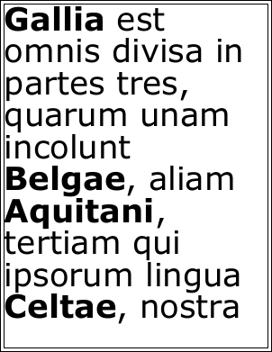

# Multistyle Example

This example shows how to create multistyled text.

## Setup

We want to display all our proper names in bold so we enclose them in bold tags.

[C#]

```csharp
string text = "Gallia est omnis divisa in partes tres, quarum unam incolunt Belgae, aliam Aquitani, tertiam qui ipsorum lingua Celtae, nostra Galli appellantur.";
```

**[Visual Basic]**

```vbnet
Dim theText As String = "Gallia est omnis divisa in partes tres, quarum unam incolunt Belgae, aliam Aquitani, tertiam qui ipsorum lingua Celtae, nostra Galli appellantur."
```

## Doc Obj

Next we create an ABCpdf Doc object and give it some basic settings. Although we could pass our styled text directly to the AddTextStyled function, we can take more control over the way that fonts are added to the PDF if we specify font IDs.

[C#]

```csharp
using var doc = new Doc();
doc.FontSize = 72;
doc.Rect.Inset(10, 10);
doc.FrameRect();
int font1 = doc.EmbedFont("Verdana", LanguageType.Latin, false, true);
int font2 = doc.EmbedFont("Verdana Bold", LanguageType.Latin, false, true);
```

**[Visual Basic]**

```vbnet
Using doc As New Doc()
  doc.FontSize = 72
  doc.Rect.Inset(10, 10)
  doc.FrameRect()
  Dim theFont1 As Integer = doc.EmbedFont("Verdana", LanguageType.Latin, False, True)
  Dim theFont2 As Integer = doc.EmbedFont("Verdana Bold", LanguageType.Latin, False, True)
```

## Adding

We replace the bold tags with font tags that directly reference our chosen fonts and then add the styled text to the current rectangle.

[C#]

```csharp
text = "" + text + "";
text = text.Replace("", "");
text = text.Replace("", "");
doc.AddTextStyled(text);
```

**[Visual Basic]**

```vbnet
theText = "" + theText + ""
theText = theText.Replace("", "")
theText = theText.Replace("", "")
doc.AddTextStyled(theText)
```

## Save

Finally we save and clear the document.

[C#]

```csharp
doc.Save(Server.MapPath("styles.pdf"));
```

**[Visual Basic]**

```vbnet
doc.Save(Server.MapPath("styles.pdf"))
End Using
```

## Results

 styles.pdf