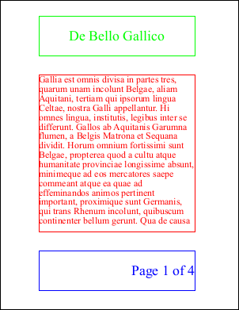
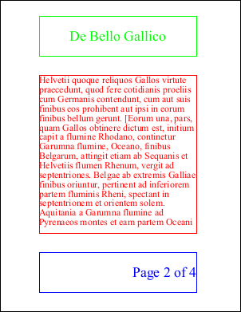
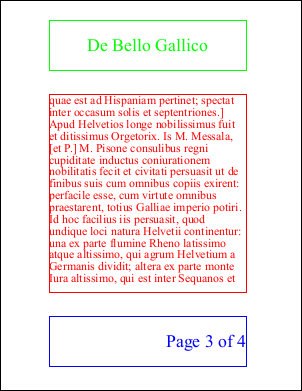
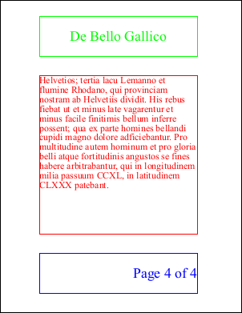

# Headers and Footers Example

This example shows one method of adding headers and footers.

## Setup

First we create an ABCpdf Doc object and define the content we're going to be adding.

[C#]

```csharp
using var doc = new Doc();
string text = "Gallia est omnis divisa in partes tres, quarum unam incolunt Belgae, aliam Aquitani, tertiam qui ipsorum lingua Celtae, nostra Galli appellantur. Hi omnes lingua, institutis, legibus inter se differunt. Gallos ab Aquitanis Garumna flumen, a Belgis Matrona et Sequana dividit. Horum omnium fortissimi sunt Belgae, propterea quod a cultu atque humanitate provinciae longissime absunt, minimeque ad eos mercatores saepe commeant atque ea quae ad effeminandos animos pertinent important, proximique sunt Germanis, qui trans Rhenum incolunt, quibuscum continenter bellum gerunt. Qua de causa Helvetii quoque reliquos Gallos virtute praecedunt, quod fere cotidianis proeliis cum Germanis contendunt, cum aut suis finibus eos prohibent aut ipsi in eorum finibus bellum gerunt. [Eorum una, pars, quam Gallos obtinere dictum est, initium capit a flumine Rhodano, continetur Garumna flumine, Oceano, finibus Belgarum, attingit etiam ab Sequanis et Helvetiis flumen Rhenum, vergit ad septentriones. Belgae ab extremis Galliae finibus oriuntur, pertinent ad inferiorem partem fluminis Rheni, spectant in septentrionem et orientem solem. Aquitania a Garumna flumine ad Pyrenaeos montes et eam partem Oceani quae est ad Hispaniam pertinet; spectat inter occasum solis et septentriones.] Apud Helvetios longe nobilissimus fuit et ditissimus Orgetorix. Is M. Messala, [et P.] M. Pisone consulibus regni cupiditate inductus coniurationem nobilitatis fecit et civitati persuasit ut de finibus suis cum omnibus copiis exirent: perfacile esse, cum virtute omnibus praestarent, totius Galliae imperio potiri. Id hoc facilius iis persuasit, quod undique loci natura Helvetii continentur: una ex parte flumine Rheno latissimo atque altissimo, qui agrum Helvetium a Germanis dividit; altera ex parte monte Iura altissimo, qui est inter Sequanos et Helvetios; tertia lacu Lemanno et flumine Rhodano, qui provinciam nostram ab Helvetiis dividit. His rebus fiebat ut et minus late vagarentur et minus facile finitimis bellum inferre possent; qua ex parte homines bellandi cupidi magno dolore adficiebantur. Pro multitudine autem hominum et pro gloria belli atque fortitudinis angustos se fines habere arbitrabantur, qui in longitudinem milia passuum CCXL, in latitudinem CLXXX patebant.";
```

**[Visual Basic]**

```vbnet
Using doc As New Doc()
  Dim theID As Integer, theCount As Integer
  Dim theText As String = "Gallia est omnis divisa in partes tres, quarum unam incolunt Belgae, aliam Aquitani, tertiam qui ipsorum lingua Celtae, nostra Galli appellantur. Hi omnes lingua, institutis, legibus inter se differunt. Gallos ab Aquitanis Garumna flumen, a Belgis Matrona et Sequana dividit. Horum omnium fortissimi sunt Belgae, propterea quod a cultu atque humanitate provinciae longissime absunt, minimeque ad eos mercatores saepe commeant atque ea quae ad effeminandos animos pertinent important, proximique sunt Germanis, qui trans Rhenum incolunt, quibuscum continenter bellum gerunt. Qua de causa Helvetii quoque reliquos Gallos virtute praecedunt, quod fere cotidianis proeliis cum Germanis contendunt, cum aut suis finibus eos prohibent aut ipsi in eorum finibus bellum gerunt. [Eorum una, pars, quam Gallos obtinere dictum est, initium capit a flumine Rhodano, continetur Garumna flumine, Oceano, finibus Belgarum, attingit etiam ab Sequanis et Helvetiis flumen Rhenum, vergit ad septentriones. Belgae ab extremis Galliae finibus oriuntur, pertinent ad inferiorem partem fluminis Rheni, spectant in septentrionem et orientem solem. Aquitania a Garumna flumine ad Pyrenaeos montes et eam partem Oceani quae est ad Hispaniam pertinet; spectat inter occasum solis et septentriones.] Apud Helvetios longe nobilissimus fuit et ditissimus Orgetorix. Is M. Messala, [et P.] M. Pisone consulibus regni cupiditate inductus coniurationem nobilitatis fecit et civitati persuasit ut de finibus suis cum omnibus copiis exirent: perfacile esse, cum virtute omnibus praestarent, totius Galliae imperio potiri. Id hoc facilius iis persuasit, quod undique loci natura Helvetii continentur: una ex parte flumine Rheno latissimo atque altissimo, qui agrum Helvetium a Germanis dividit; altera ex parte monte Iura altissimo, qui est inter Sequanos et Helvetios; tertia lacu Lemanno et flumine Rhodano, qui provinciam nostram ab Helvetiis dividit. His rebus fiebat ut et minus late vagarentur et minus facile finitimis bellum inferre possent; qua ex parte homines bellandi cupidi magno dolore adficiebantur. Pro multitudine autem hominum et pro gloria belli atque fortitudinis angustos se fines habere arbitrabantur, qui in longitudinem milia passuum CCXL, in latitudinem CLXXX patebant."
```

## Content

We set up the style for our content.

We need to specify the Rect defining the area in which content will be inserted, a color (red) and a font size.

We add the text using the same method as employed in the [Text Flow Example](02-textflow.md). We draw a frame round our content area each time so we can see how the text has been positioned.

[C#]

```csharp
doc.Rect.String = "100 200 500 600";
doc.Color.String = "255 0 0";
doc.FontSize = 24;
int id = doc.AddTextStyled(text);
doc.FrameRect();
while (doc.Chainable(id)) {
  doc.Page = doc.AddPage();
  id = doc.AddTextStyled("", id);
  doc.FrameRect();
}
int count = doc.PageCount;
```

**[Visual Basic]**

```vbnet
doc.Rect.String = "100 200 500 600"
doc.Color.String = "255 0 0"
doc.FontSize = 24
theID = doc.AddTextStyled(theText)
doc.FrameRect()
While doc.Chainable(theID)
  doc.Page = doc.AddPage()
  theID = doc.AddTextStyled("", theID)
  doc.FrameRect()
End While
theCount = doc.PageCount
```

## Header

We set up the style for our header.

We need to specify the Rect defining the area in which the header will be inserted, a color (green) and a font size. We use the HPos and VPos parameters to center the text both horizontally and vertically.

We then iterate through the pages in the document adding headers as we go. We frame our headers so we can see the header area.

[C#]

```csharp
doc.Rect.String = "100 650 500 750";
doc.TextStyle.HPos = 0.5;
doc.TextStyle.VPos = 0.5;
doc.Color.String = "0 255 0";
doc.FontSize = 36;
for (int i = 1; i <= count; i++) {
  doc.PageNumber = i;
  doc.AddText("De Bello Gallico");
  doc.FrameRect();
}
```

**[Visual Basic]**

```vbnet
doc.Rect.String = "100 650 500 750"
doc.TextStyle.HPos = 0.5
doc.TextStyle.VPos = 0.5
doc.Color.String = "0 255 0"
doc.FontSize = 36
Dim i As Integer = 1
While i <= theCount
  doc.PageNumber = i
  doc.AddText("De Bello Gallico")
  doc.FrameRect()
  System.Math.Max(System.Threading.Interlocked.Increment(i),i - 1)
End While
```

## Footer

We set up the style for our footer.

We need to specify the Rect defining the area in which the footer will be inserted, a color (blue) and a font size. We use the HPos and VPos parameters to center the text vertically and align it to the right.

We then iterate through the pages in the document adding footers as we go. We frame our footers so we can see the footer area.

[C#]

```csharp
doc.Rect.String = "100 50 500 150";
doc.TextStyle.HPos = 1.0;
doc.TextStyle.VPos = 0.5;
doc.Color.String = "0 0 255";
doc.FontSize = 36;
for (int i = 1; i <= count; i++) {
  doc.PageNumber = i;
  doc.AddText("Page " + i.ToString() + " of " + count.ToString());
  doc.FrameRect();
}
```

**[Visual Basic]**

```vbnet
doc.Rect.String = "100 50 500 150"
doc.TextStyle.HPos = 1.0
doc.TextStyle.VPos = 0.5
doc.Color.String = "0 0 255"
doc.FontSize = 36
Dim i As Integer = 1
While i <= theCount
  doc.PageNumber = i
  doc.AddText("Page " + i.ToString() + " of " + theCount.ToString())
  doc.FrameRect()
  System.Math.Max(System.Threading.Interlocked.Increment(i),i - 1)
End While
```

## Save

Finally we save the PDF.

[C#]

```csharp
doc.Save(Server.MapPath("headerfooter.pdf"));
```

**[Visual Basic]**

```vbnet
doc.Save(Server.MapPath("headerfooter.pdf"))
End Using
```

## Results


                  headerfooter.pdf [Page 1]
                  headerfooter.pdf [Page 2]
                  headerfooter.pdf [Page 3]
                  headerfooter.pdf [Page 4]