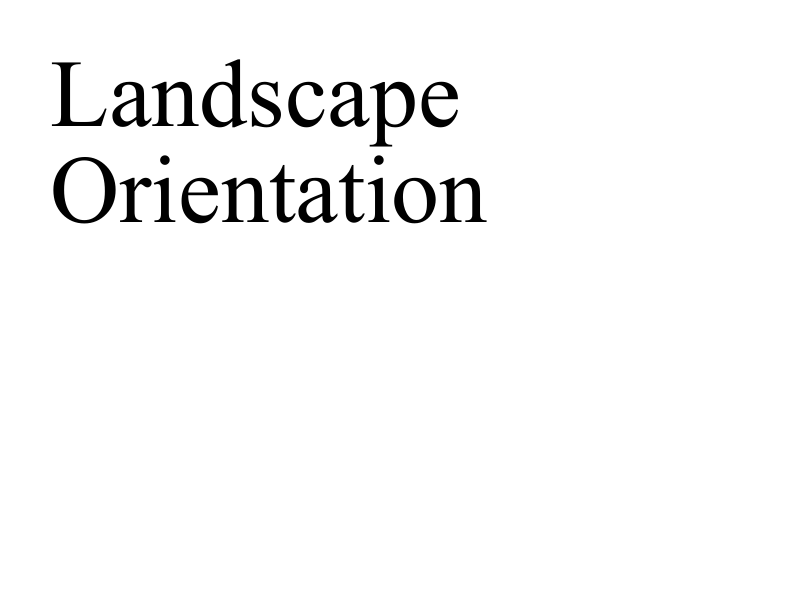

# Landscape Example

This example shows how to create a PDF document rotated by 90 degrees for a landscape rather than portrait view.

## Setup

We start by creating a PDF document. We use two transforms to apply a generic 90 degree rotation around the center of the document and rotate the drawing rectangle by the same amount. After applying our rotation we add some text to the page.

[C#]

```csharp
using var doc = new Doc();
// apply a rotation transform
double w = doc.MediaBox.Width;
double h = doc.MediaBox.Height;
double l = doc.MediaBox.Left;
double b = doc.MediaBox.Bottom;
doc.Transform.Rotate(90, l, b);
doc.Transform.Translate(w, 0);

// rotate our rectangle
doc.Rect.Width = h;
doc.Rect.Height = w;

// add some text
doc.Rect.Inset(50, 50);
doc.FontSize = 96;
doc.AddText("Landscape Orientation");
```

**[Visual Basic]**

```vbnet
Using doc As New Doc()
  ' apply a rotation transform
  Dim w As Double = doc.MediaBox.Width
  Dim h As Double = doc.MediaBox.Height
  Dim l As Double = doc.MediaBox.Left
  Dim b As Double = doc.MediaBox.Bottom
  doc.Transform.Rotate(90, l, b)
  doc.Transform.Translate(w, 0)

  ' rotate our rectangle
  doc.Rect.Width = h
  doc.Rect.Height = w

  ' add some text
  doc.Rect.Inset(50, 50)
  doc.FontSize = 96
  doc.AddText("Landscape Orientation")
```

## Rotate

Drawing the text rotated does not rotate the page itself. To change the default orientation of the document we need to apply a rotation to the root page object. By doing this we ensure that every page in the document is viewed rotated.

[C#]

```csharp
// adjust the default rotation and save
int id = doc.GetInfoInt(doc.Root, "Pages");
doc.SetInfo(id, "/Rotate", "90");
doc.Save(Server.MapPath("landscape.pdf"));
```

**[Visual Basic]**

```vbnet
' adjust the default rotation and save
  Dim theID As Integer = doc.GetInfoInt(doc.Root, "Pages")
  doc.SetInfo(theID, "/Rotate", "90")
  doc.Save(Server.MapPath("landscape.pdf"))
End Using
```

## Results

 landscape.pdf