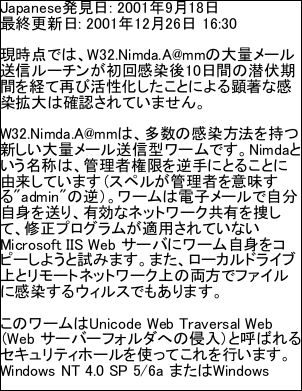
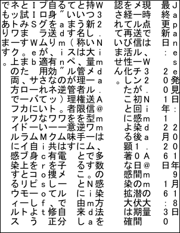

# Unicode Example

This example shows how to add complex scripts such as Chinese, Japanese and Korean. Here we choose to embed and subset our font to ensure our document renders correctly on all platforms.

## Setup

First we create an ABCpdf Doc object and set the font size.

[C#]

```csharp
using var doc = new Doc();
doc.FontSize = 32;
```

**[Visual Basic]**

```vbnet
Using doc As New Doc()
  doc.FontSize = 32
```

## Read

We read in our Japanese text from a Unicode text file.

[C#]

```csharp
string path = Server.MapPath("../Rez/Japanese2.txt");
string text = File.ReadAllText(path);
```

**[Visual Basic]**

```vbnet
Dim thePath As String = Server.MapPath("../Rez/Japanese2.txt")
Dim theText As String = File.ReadAllText(thePath)
```

## Add

Because we want to ensure that our document renders correctly on all platforms we're going to embed our font in Unicode format. We specify a left-to-right writing direction and we choose to subset our font.

Please note when embedding fonts you must ensure you have permission to embed and redistribute the embedded font as part of your PDF.

[C#]

```csharp
doc.Page = doc.AddPage();
doc.Font = doc.EmbedFont("MS PGothic", LanguageType.Unicode, false, true);
doc.AddText("Japanese" + text);
```

**[Visual Basic]**

```vbnet
doc.Page = doc.AddPage()
doc.Font = doc.EmbedFont("MS PGothic", LanguageType.Unicode, False, True)
doc.AddText("Japanese" + theText)
```

## Add

Just to show how it works we'll also render a page in vertical writing mode.

[C#]

```csharp
doc.Page = doc.AddPage();
doc.Font = doc.EmbedFont("MS PGothic", LanguageType.Unicode, true, true);
doc.AddText("Japanese" + text);
```

**[Visual Basic]**

```vbnet
doc.Page = doc.AddPage()
doc.Font = doc.EmbedFont("MS PGothic", LanguageType.Unicode, True, True)
doc.AddText("Japanese" + theText)
```

## Save

Finally we save at a specified location.

[C#]

```csharp
doc.Save(Server.MapPath("unicode.pdf"));
// finished
```

**[Visual Basic]**

```vbnet
doc.Save(Server.MapPath("unicode.pdf"))
End Using
' finished
```

## Results

We get the following output.


                  unicode.pdf - [Page 1]
                  unicode.pdf - [Page 2]