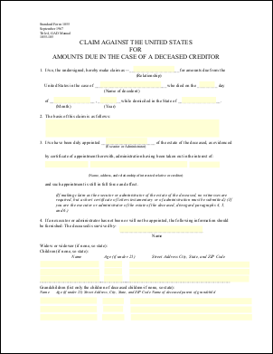

# eForm Placeholder Example

This example shows how to use eForm fields as placeholders for the insertion of text. In this example we simply replace each of the fields in a form with the name of that field.

## Src

First we create an ABCpdf Doc object and read in our template form.

[C#]

```csharp
using var doc = new Doc();
doc.Read(Server.MapPath("../mypics/form.pdf"));
doc.Form.NeedAppearances = false; // for PDF 2.0
doc.Font = doc.AddFont("Helvetica-Bold");
doc.FontSize = 16;
doc.Rect.Pin = XRect.Corner.TopLeft;
```

**[Visual Basic]**

```vbnet
Using doc As New Doc()
  doc.Read(Server.MapPath("../mypics/form.pdf"))
  doc.Form.NeedAppearances = False
  ' for PDF 2.0
  doc.Font = doc.AddFont("Helvetica-Bold")
  doc.FontSize = 16
  doc.Rect.Pin = XRect.Corner.TopLeft
```

## Add

We iterate through each of the fields. For each field we focus on the field. We then color the rectangle light gray and draw the name of the field in dark red.

[C#]

```csharp
var names = doc.Form.GetFieldNames();
foreach (string name in names) {
  Field theField = doc.Form[name];
  theField.Focus();
  doc.Color.String = "240 240 255";
  doc.FillRect();
  doc.Rect.Height = 16;
  doc.Color.String = "220 0 0";
  doc.AddText(theField.Name);
  doc.Delete(theField.ID);
}
```

**[Visual Basic]**

```vbnet
Dim theNames As String() = doc.Form.GetFieldNames()
For Each theName As String In theNames
  Dim theField As Field = doc.Form(theName)
  theField.Focus()
  doc.Color.String = "240 240 255"
  doc.FillRect()
  doc.Rect.Height = 16
  doc.Color.String = "220 0 0"
  doc.AddText(theField.Name)
  doc.Delete(theField.ID)
Next
```

## Save

Finally we save.

[C#]

```csharp
doc.Save(Server.MapPath("eform.pdf"));
```

**[Visual Basic]**

```vbnet
doc.Save(Server.MapPath("eform.pdf"))
End Using
```

## Results

Given the following document.

 form.pdf

This is the kind of output you might expect.

 eform.pdf