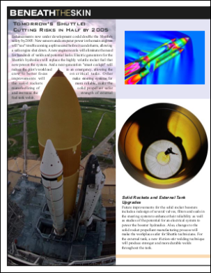
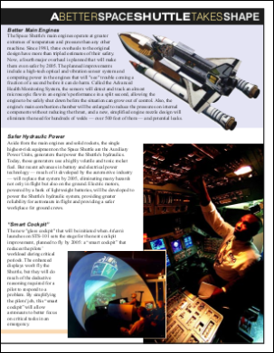
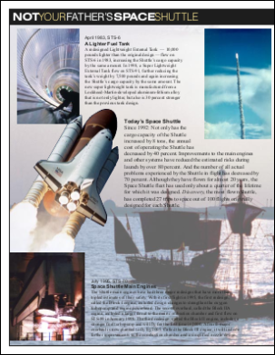

# PDF Rendering Example

This example shows how to render a PDF document.

For an example of how to render a PDF direct to screen and how to print a PDF see the ABCpdfView project and classes under the ABCpdf menu item.

## Read

We create an ABCpdf Doc object and read our source PDF.

[C#]

```csharp
using Doc doc = new Doc();
doc.Read(Server.MapPath("../Rez/spaceshuttle.pdf"));
```

**[Visual Basic]**

```vbnet
Dim doc As New Doc()
doc.Read(Server.MapPath("../Rez/spaceshuttle.pdf"))
```

## Prefs

We specify our base rendering settings.

[C#]

```csharp
doc.Rendering.DotsPerInch = 36;
```

**[Visual Basic]**

```vbnet
doc.Rendering.DotsPerInch = 36
```

## Save

Finally we save the first four pages of the document in png format.

[C#]

```csharp
for (int i = 1; i <= 4; i++) {
  doc.PageNumber = i;
  doc.Rect.String = doc.CropBox.String;
  doc.Rendering.Save(Server.MapPath("shuttle_p" + i.ToString() + ".png"));
}
```

**[Visual Basic]**

```vbnet
Dim i As Integer = 1
While i <= 4
  doc.PageNumber = i
  doc.Rect.String = doc.CropBox.[String]
  doc.Rendering.Save(Server.MapPath("shuttle_p" + i.ToString() + ".png"))
  System.Math.Max(System.Threading.Interlocked.Increment(i),i - 1)
End While
```

## Results

 shuttle_p1.png

 shuttle_p2.png

 shuttle_p3.png

 shuttle_p4.png