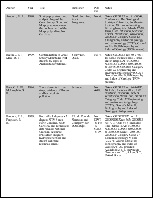
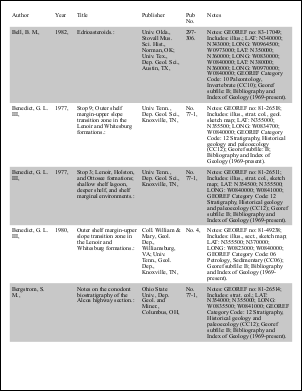
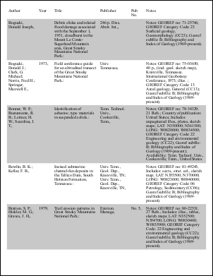
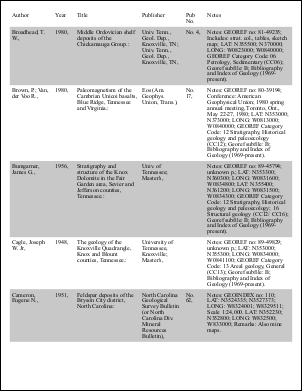

# WPF Tables Example

This example shows how to import Windows Presentation Foundation (WPF) Extensible Application Markup Language (XAML) tables into a PDF document. Each table has been specified in a XAML file.

You can find the full project and classes under the ABCpdf menu item. The project includes code for laying out four different types of tables. Two get their input data from text files and two from XML files.

The tables are intentionally very similar to those in the [Small Table Example](09-table1.md) and [Large Table Example](10-table2.md) to allow you to compare the two different layout methods.

WPF Limitations. The WPF Table component does not support the following features:

WPF supports row and column backgrounds and table and cell borders. However, it does not support row or column borders.

WPF does not support automatic header and footer repetition when a table is split across pages. Some people appear to have extended the DocumentPaginator class to add headers manually in code during the XPS serialization process. However, our code does not demonstrate this technique.

WPF does not directly support list data binding. By this, we mean that there is no way to define a row template and then have the table automatically add a row for each data item in the data provider. We achieve this functionality by manipulating the XAML code in memory to add additional rows.

## XAML

First, we define the table structure.

Our Small and Large tables have a fairly simple structure. For example, the small table structure is defined in a XAML design file - SmallTable.xaml.

``` ; ```

Refer to the [MSDN WPF Table Overview](http://msdn2.microsoft.com/en-us/library/ms747133.aspx) for more information on how to define WPF tables. Note that we are using Table and not Grid because we need to place our table in a Flow Document. Although Grid can be wrapped in a UI container so as to appear in a flow document, it cannot be split over multiple pages.

Our table definition contains a single row with five columns. We will see later on how to duplicate this row so that there is one for every item in the data source so as to achieve list binding in code. Our data source is defined as follows:

```undefined

```

Our TextDataProvider is a custom-written class that extracts text from a tab separated input file. It supplies this text to the targets via the binding indicated by the DataContext and Binding attributes:

```undefined

```

... indicates that this row group is bound to the first line of the file.

```undefined

```

... indicates that the text block in this cell is bound to the first column of the line.

The large table structure is almost identical to the small table structure. It is defined in LargeTable.xaml. Because the pagination is done automatically by the flow document paginator, the implementation of the two tables is identical apart from the small differences in the XAML table definitions. The difference between the table definitions is that they bind to different input files and have different numbers of columns.

## Bind

Next, we add the table rows

Because Table does not support binding to a collection of Items (unlike for example other WPF UI controls such as ListBox or ItemsControl) - also known as list binding, we manually add table rows in code.

To do so, we load the XAML design file at runtime. We then use XML classes to duplicate rows and bind them to different data items. To load XAML design files at runtime, we must set their type as "Content" in the Visual Studio file properties. It may also help to copy them into the binary location.

[C#]

```csharp
MemoryStream ModifyXamlUsingTextProvider(string mDataProvider, string mXamlFile, string mTableXamlLocation, string mTableName) {
  var dataProvider = new TextDataProvider(mDataProvider);
  var xamlDoc = new XmlDocument();
  var xamlFile = new FileStream(mXamlFile, FileMode.Open);
  xamlDoc.Load(xamlFile);

  var nsmgr = new XmlNamespaceManager(xamlDoc.NameTable);
  nsmgr.AddNamespace("x", "http://schemas.microsoft.com/winfx/2006/xaml/presentation");

  var itemsTable = xamlDoc.DocumentElement.SelectSingleNode(mTableXamlLocation + "[@Name='" + mTableName + "']", nsmgr);

  for (int i = 1; i < dataProvider.Count; i++) {
    var rowGroup = itemsTable.LastChild;
    var newRowGroup = rowGroup.Clone();
    string bindingText = newRowGroup.Attributes["DataContext"].Value;
    bindingText = bindingText.Remove(bindingText.LastIndexOf('[')) + "[" + i + "] }";
    newRowGroup.Attributes["DataContext"].Value = bindingText;
    newRowGroup.Attributes["Background"].Value = (i % 2) == 0 ? "White" : "LightGray";
    itemsTable.InsertAfter(newRowGroup, rowGroup);
  }

  var memStream = new MemoryStream();
  xamlDoc.Save(memStream);
  xamlFile.Close();
  return memStream;
}
```

[Visual Basic]

```vbnet
Private Function ModifyXamlUsingTextProvider(mDataProvider As String, mXamlFile As String, mTableXamlLocation As String, mTableName As String) As MemoryStream
  Dim dataProvider As New TextDataProvider(mDataProvider)
  Dim xamlDoc As New XmlDocument()
  Dim xamlFile As New FileStream(mXamlFile, FileMode.Open)
  xamlDoc.Load(xamlFile)

  Dim nsmgr As New XmlNamespaceManager(xamlDoc.NameTable)
  nsmgr.AddNamespace("x", "http://schemas.microsoft.com/winfx/2006/xaml/presentation")

  Dim itemsTable As XmlNode = xamlDoc.DocumentElement.SelectSingleNode(mTableXamlLocation + "[@Name='" + mTableName + "']", nsmgr)

  Dim i As Integer = 1
  While i < dataProvider.Count
    Dim rowGroup As XmlNode = itemsTable.LastChild
    Dim newRowGroup As XmlNode = rowGroup.Clone()
    Dim bindingText As String = newRowGroup.Attributes("DataContext").Value
    bindingText = bindingText.Remove(bindingText.LastIndexOf("["C)) + "[" + i + "] }"
    newRowGroup.Attributes("DataContext").Value = bindingText
    newRowGroup.Attributes("Background").Value = If((i Mod 2) = 0, "White", "LightGray")
    itemsTable.InsertAfter(newRowGroup, rowGroup)
    System.Math.Max(System.Threading.Interlocked.Increment(i),i - 1)
  End While

  Dim memStream As New MemoryStream()
  xamlDoc.Save(memStream)
  xamlFile.Close()
  Return memStream
End Function
```

The data provider is loaded directly from code so we know how many data items (text file lines) are available. The XAML design document is loaded as a XmlDocument. We retrieve the XML node that corresponds to our table via the Xpath query passed to SelectSingleNode() in the document element. For this, we need to load the WPF namespace else the query will fail.

Once we have our items table, we get hold of the row group. The row group is the last child of the table. We duplicate the row group by using the XmlNode.Clone() method and then change the data binding to point to the next row. We also alternate the row background colors. After all items have been added, we save the XML document into a memory stream.

[C#]

```csharp
using var stm = ModifyXamlUsingTextProvider(null, null, null, null);
var page = XamlReader.Load(stm) as System.Windows.Controls.Page;
var docViewer = LogicalTreeHelper.FindLogicalNode(page, "DocViewer") as FlowDocumentPageViewer;
page.Content = null;
```

[Visual Basic]

```vbnet
Dim stm As Stream = ModifyXamlUsingTextProvider(Nothing, Nothing, Nothing, Nothing)
Dim page = TryCast(XamlReader.Load(stm), System.Windows.Controls.Page)
Dim docViewer As FlowDocumentPageViewer = TryCast(LogicalTreeHelper.FindLogicalNode(page, "DocViewer"), FlowDocumentPageViewer)
page.Content = Nothing
stm.Close()
```

We use XamlReader.Load() to load the root object specified in the
              XAML design file (stored in the memory stream). This is not the
              Table, or the FlowDocument (so as to then convert it directly to
              XPS and PDF as shown below); it is a Page. This is because it is
              convenient to view the Table in the Visual Studio XAML designer
              so we chose to have a Page as the root element. This page contains
              a flow document viewer and this allows the designer to show the
              table as we type XML tags. We then simply discard the page and keep
              the document viewer if we want to show the document in a window
              or we just keep the document if we only want to convert it to XPS.
              The page content must be set to null; otherwise, the child elements
              (the document viewer and document) cannot be attached to a different
              container (the window or the XPS document). 
## Save

The table is saved as XPS first and then converted into PDF.

[C#]

```csharp
void SaveToXps(Stream fileStream, FlowDocumentPageViewer viewer) {
  using var package = Package.Open(fileStream, FileMode.Create, FileAccess.ReadWrite);
  using var doc = new XpsDocument(package);
  var writer = XpsDocument.CreateXpsDocumentWriter(doc);
  var document = viewer.Document;
  writer.Write(document.DocumentPaginator);
}

void SaveToPdf(string pdfFileName, FlowDocumentPageViewer viewer) {
  using  var memStream = new MemoryStream();
  SaveToXps(memStream, viewer);
  using var pdfDoc = new Doc();
  pdfDoc.Read(memStream, new XReadOptions() { FileExtension = ".xps" });
  pdfDoc.Save(pdfFileName);
}
```

[Visual Basic]

```vbnet
Private Sub SaveToXps(fileStream As Stream, viewer As FlowDocumentPageViewer)
  Dim package__1 = Package.Open(fileStream, FileMode.Create, FileAccess.ReadWrite)
  Dim doc = New XpsDocument(package__1)
  Dim writer = XpsDocument.CreateXpsDocumentWriter(doc)
  Dim document = viewer.Document
  writer.Write(document.DocumentPaginator)
  doc.Close()
  package__1.Close()
End Sub

Private Sub SaveToPdf(pdfFileName As String, viewer As FlowDocumentPageViewer)
  Dim memStream As New MemoryStream()
  SaveToXps(memStream, viewer)
  Dim pdfDoc = New Doc()
  pdfDoc.Read(memStream, New XReadOptions() With { _
    Key .FileExtension = ".xps" _
  })
  pdfDoc.Save(pdfFileName)
  pdfDoc.Clear()
  memStream.Close()
End Sub
```

We create an XPS file in memory using MemoryStream. We then pass the document paginator to the XPS writer. The document paginator splits the flow document into a set of pages and writes them to the XPS document. The PDF document Read() method accepts a Stream containing the XPS document and a type. After the XPS document has been loaded into the PDF document, this can be saved to file.

## XML

The Invoice and Space table examples bind to an XML data source and have a more complex structure.

As such, please see the XAML design files, InvoiceTable.xaml and SpaceTable.xml, for the full table structure.

Because the table input data is specified as XML, we can use the WPF standard data provider, XmlDataProvider, instead of our own custom TextDataProvider.

Because the data provider is XML, we can use the XmlDocument for the data files as well as XAML design files.

Each table item is mapped to an XML item so we can count the XML items and add a new row group for each one of them (bar of course the first one as defined in the design file). Note that the XmlDataProvider indexing is one rather than zero based.

## Results

We get output very similar to that from the Tables Example project. For example.

 table2.pdf - [Page 1]


                  table2.pdf - [Page 2]
                  table2.pdf - [Page 3]
                  table2.pdf - [Page 4]
                  table2.pdf - [Page 5]