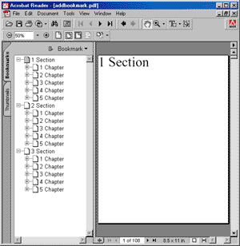

# AddBookmark Function

Adds a bookmark pointing to the current page.

## Syntax

## Params

| **Name** | **Description** |
| --- | --- |
| path | The path to the bookmark. |
| open | Whether the bookmark should be displayed open (expanded) or closed (collapsed). |
| return | The Object ID of the newly added Bookmark Object. |

## Notes

Adds a bookmark which points to the current page.

Bookmarks are specified as paths in much the same way as file paths. Headings and subheadings are separated by a backslash character. For example:

"1. Introduction\1.1 Aim and Methods\1.1.3 Diagrams"

When a bookmark is added, intermediate headings and subheadings will be created if they do not already exist.

To add multiple bookmarks all referring to the same page simply call the AddBookmark function multiple times.

This function returns the Object ID of the newly added Bookmark Object.

---
**Hyperlinks.**
Sometimes you may wish to insert bookmarks which link to an external web page specified using a URI or URL. You can do this using hyperlink code of the following form. Please do ensure that your URLs come from trusted sources only. You do not want to be in a situation in which people can add links to malware or other dubious locations.

[C#]

```csharp
static int AddBookmarkToUri(Doc doc, string bookmark, string uri) {
  int id = doc.AddBookmark(bookmark, true);
  doc.SetInfo(id, "/Dest:Del", ""); // remove link to page and add link to url
  doc.SetInfo(id, "/A", "<< /Type /Action /S /URI /URI () >>");
  doc.SetInfo(id, "/A/URI:Text", uri);
  return id;
}
```

---

## Example

The following code adds a sequence of pages with a nested sequence of bookmarks. The image shows the appearance of the document outline. Note that none of the subject pages are visible because the chapter pages were added in a collapsed state.

[C#]

```csharp
using var doc = new Doc();
doc.FontSize = 64;
for (int i = 1; i < 4; i++) {
  doc.Page = doc.AddPage();
  string theSection = $"{i} Section";
  doc.AddText(theSection);
  doc.AddBookmark(theSection, true);
  for (int j = 1; j < 6; j++) {
    doc.Page = doc.AddPage();
    string theChapter = $"{theSection}\\{j} Chapter";
    doc.AddText(theChapter);
    doc.AddBookmark(theChapter, false);
    for (int k = 1; k < 7; k++) {
      doc.Page = doc.AddPage();
      string theSubject = $"{theChapter}\\{k} Subject";
      doc.AddText(theSubject);
      doc.AddBookmark(theSubject, true);
    }
  }
}
doc.Save("docaddbookmark.pdf");
```


docaddbookmark.pdf

