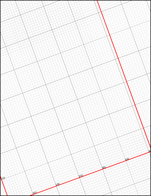

# AddGrid Function

Adds a visible grid to the current page.

## Syntax

**[C#]**

```csharp
int AddGrid()
```

<span class=language>[Visual
            Basic]</span>  
`Function AddGrid() As Integer`
## Params

| Name | Description | 
| --- | --- |
| return | The Object ID of the newly added Grid Object. | 

## Notes

Adds a visible grid to the current page. The grid shows locations on the page and the effect of the current transform. It is designed to help with object positioning during development.

## Example

The following code modifies the page transform and then adds a grid to show how the transform has affected the page.

[C#]

```csharp
using var doc = new Doc();
doc.Page = doc.AddPage();
doc.Transform.Rotate(20, 100, 100);
doc.AddGrid();
doc.Save(Server.MapPath("docaddgrid.pdf"));
```

<span class=language>[Visual Basic]</span>
```vbnet
Using doc As New Doc()
  doc.Page = doc.AddPage()
  doc.Transform.Rotate(20, 100, 100)
  doc.AddGrid()
  doc.Save(Server.MapPath("docaddgrid.pdf"))
End Using
```

docaddgrid.pdf