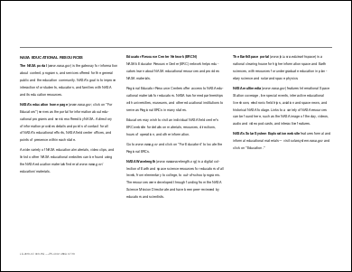
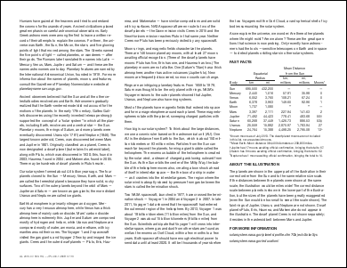
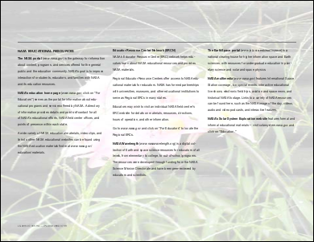
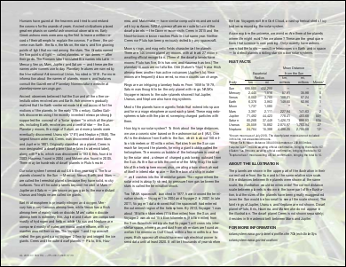

# AddImageCopy Function

Adds a copy of an existing image in the Doc, to the current page.

## Syntax

**[C#]**

```csharp
int AddImageCopy(int id)
```

<span class=language>[Visual
            Basic]</span>  
`Function AddImageCopy(id As Integer) As Integer``may throw Exception()`

## Params

| Name | Description | 
| --- | --- |
| id | An existing image object ID to be copied to the page again. | 
| return | The ID of the newly added Image Object. | 

## Notes

Adds a copy of an image which has already been inserted elsewhere in the document.

You can use this facility to add commonly used graphics such as watermarks. The raw image data is inserted only once which means that PDF size is greatly reduced.

This method only works with raster or bitmap images. So your ID must have been obtained from a previous call to [AddImageFile](addimagefile.md), [AddImageData](addimagedata.md) or [AddImageObject](addimageobject.md).

The image is scaled to fill the current [Rect](../2-properties/rect.md). It is transformed using the current [Transform](../../xtransform/default.md).

## Example

This example shows how to read an existing PDF document and insert a background image into every page.

We start by reading our template PDF document and finding out core information we will need to reference each page.

[C#]

```csharp
using var doc = new Doc();
doc.Read(Server.MapPath("../mypics/sample.pdf"));
int count = doc.PageCount;
```

<span class=language>[Visual Basic]</span>
```vbnet
Using doc As New Doc()
  doc.Read(Server.MapPath("../mypics/sample.pdf"))
  Dim theCount As Integer = doc.PageCount
```

We cycle through the pages inserting images as we go.

We set the layer property to ensure that the image gets added in the background rather than on top of existing content.

The first time we add an image file. Subsequent times we reference the image ID. This means that we embed only one copy of the image data and simply reference that data from each page.

Finally we save the modified PDF.

[C#]

```csharp
int id = 0;
for (int i = 1; i <= count; i++) {
  doc.PageNumber = i;
  doc.Layer = doc.LayerCount + 1;
  if (i == 1) {
    string path = Server.MapPath("../mypics/light.jpg");
    id = doc.AddImageFile(path, 1);
  }
  else
    doc.AddImageCopy(id);
}
doc.Save(Server.MapPath("watermark.pdf"));
```

<span class=language>[Visual Basic]</span>
```vbnet
Dim theID As Integer = 0
  Dim i As Integer = 1
  While i <= theCount
    doc.PageNumber = i
    doc.Layer = doc.LayerCount + 1
    If i = 1 Then
      Dim thePath As String = Server.MapPath("../mypics/light.jpg")
      theID = doc.AddImageFile(thePath, 1)
    Else
      doc.AddImageCopy(theID)
    End If
    System.Math.Max(System.Threading.Interlocked.Increment(i),i - 1)
  End While
  doc.Save(Server.MapPath("watermark.pdf"))
End Using
```

Given the following document.

sample.pdf - [Page 1]sample.pdf - [Page 2]sample.pdf - [Page 3]sample.pdf - [Page 4]And the following image.

This is the kind of output you might expect.

watermark.pdf - [Page 1]watermark.pdf - [Page 2]watermark.pdf - [Page 3]watermark.pdf - [Page 4]