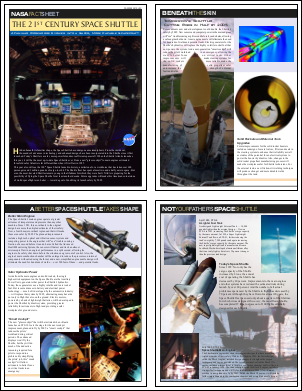
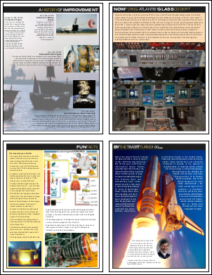

# AddImageDoc Function

Draw a page from one PDF document onto the current page of this document.

## Syntax

**[C#]**

```csharp
int AddImageDoc(Doc doc, int page, XRect rect)
int AddImageDoc(Doc doc, int page, XRect rect, bool copyAnnotations)
int AddImageDoc(Doc doc, int page, XRect rect, bool copyAnnotations, double alpha)
int AddImageDoc(Doc doc, int page, XRect rect, bool copyAnnotations, bool copyTags, double alpha)
```

<span class=language>[Visual Basic]</span>  

```
Function AddImageDoc(doc As Doc, page As Integer, rect As XRect) As Integer
Function AddImageDoc(doc As Doc, page As Integer, rect As XRect, copyAnnotations As Boolean) As Integer
Function AddImageDoc(doc As Doc, page As Integer, rect As XRect, copyAnnotations As Boolean, alpha As Double) As Integer
Function AddImageDoc(doc As Doc, page As Integer, rect As XRect, copyAnnotations As Boolean, copyTags As Boolean, alpha As Double) As Integer
```

## Params

| Name | Description | 
| --- | --- |
| doc | The document to be used as the source. | 
| page | The page you want drawn. Use one to indicate the first page. | 
| rect | The portion of the page you want drawn. Pass null to specify the entire page. | 
| copyAnnotations | Whether to copy fields and annotations - default false. | 
| copyTags | Whether to copy accessibility tags - default false. | 
| alpha | The level of alpha to apply to the drawn page from transparent through to fully opaque (0 to 255). | 
| return | The ID of the newly added Image Object. | 

## Notes

Draw a page from one PDF document onto the current page of this document returning the ID of the newly added object.

The page is scaled to fill the current [Rect](../2-properties/rect.md). It is transformed using the current [Transform](../../xtransform/default.md).

Many field and annotation types can only exist as a simple rectangle with sides parallel to the page borders. For this reason you should be cautious about the transforms you use when specifying that annotations should be copied. A transform which involves scale and translation will be fine but one involving rotation and skew factors may result in unusual output if the field or annotation does not support this combination.

If you are copying accessibility tags they are taken from the source page and placed into a non structural group. The group is then inserted at the end of the structure for the destination page. In most cases this is what you want. However tagging structures can be complex and not all documents are compatible with each other. If incompatible structures are found the structures in the destination document will be preferred over those from the source document.

The [SaveOptions.Refactor](../../xsaveoptions/2-properties/refactor.md) setting determines whether duplicate and redundant objects are eliminated. The [SaveOptions.Preflight](../../xsaveoptions/2-properties/preflight.md) setting determines whether objects in the destination document are validated before this operation is performed.

Unless the document and the pages are big in terms of memory use and have many common objects, it is faster to disable SaveOptions.Refactor and SaveOptions.Preflight for adding the pages and enable them for saving the document.

Pages may be rotated. As such, when drawing one page onto another, you may wish to copy the [Page.Rotation](../../../6-abcpdf.objects/page/2-properties/rotation.md) from the source page to the destination page. More complex example code to de-rotate a page may be found under the documentation for the Page.Rotation.

How ABCpdf .NET Masters Page Drawing Operations. ABCpdf .NET distinguishes itself by not only preserving vector content during import operations but also intelligently managing the underlying complexities that typically plague such processes. Through the AddImageDoc method and the more advanced [DrawPagesOperation](/Manual/8-abcpdf.operations/F-drawpagesoperation/default.md) class, it provides a robust, professional-grade solution.

- Advanced Resource Management: It features intelligent resource handling, automatically de-duplicating identical fonts, images, and color spaces between documents. This prevents conflicts and ensures visual consistency while optimizing the final file size. For the complete elimination of any duplicates, before saving, you should use the [ReduceSizeOperation](/Manual/8-abcpdf.operations/B-reducesizeoperation/default.md) to combine and re-subset any similar fonts.
- Precise Layout and Control: It provides extensive properties such as to manage scaling, alignment, and positioning, effortlessly handling different page sizes and preventing clipping or overflow issues. The Doc object allows easy access to the source and destination [Rect](/Manual/5-abcpdf/doc/2-properties/rect.md), the [MediaBox](/Manual/5-abcpdf/doc/2-properties/mediabox.md) and [CropBox](/Manual/5-abcpdf/doc/2-properties/cropbox.md) while the [Page](/Manual/6-abcpdf.objects/page/default.md) class also allows access to the [TrimBox](/Manual/6-abcpdf.objects/page/2-properties/trimbox.md), [ArtBox](/Manual/6-abcpdf.objects/page/2-properties/artbox.md) and [BleedBox](/Manual/6-abcpdf.objects/page/2-properties/bleedbox.md).
- Preservation of Annotations: The library is designed to maintain important elements like annotations, fields and external hyperlinks during the import process, a significant advantage over basic methods.
- Intelligent Tag Merging: The class excels at intelligently merging the logical structure trees from source documents. It correctly reassembles the tagging hierarchy, preserving reading order and semantic meaning across imported pages. For more control here you may also access the [RootTag](/Manual/8-abcpdf.operations/F-drawpagesoperation/2-properties/05-roottag.md) to allow you to customize the location of the inserted page within the semantic structure of the destination document.
- Preservation of Accessibility: This robust handling ensures that the imported content does not become a "tag black hole." Screen readers can continue to navigate and interpret the content logically, which is a fundamental requirement for creating inclusive, professional-grade documents.
- Optimized Performance: The DrawPagesOperation is engineered for efficiency when copying many pages from one document to another. It handles the processing of complex document structures and resources in a streamlined manner to avoid performance overhead and reduce file bloat.

Crucially, both approaches are built upon ABCpdf's deep understanding of the PDF specification, ensuring that color spaces, transparency, and overprint settings are correctly interpreted and rendered. By offering both a straightforward method (AddImageDoc) and a powerful, optimized class (DrawPagesOperation), ABCpdf .NET gives developers the tools to implement reliable, efficient, and high-quality vector import operations without the typical pitfalls, ensuring professional results every time.

## Example

This example shows how to draw one PDF into another. It takes a PDF document and creates a 'four-up' summary document by drawing four pages on each page of the new document.

First we create an ABCpdf Doc object and read in our source document.

[C#]

```csharp
using var src = new Doc();
src.Read(Server.MapPath("../Rez/spaceshuttle.pdf"));
int count = src.PageCount;
```

<span class=language>[Visual Basic]</span>
```vbnet
Dim theSrc As New Doc()
theSrc.Read(Server.MapPath("../Rez/spaceshuttle.pdf"))
Dim theCount As Integer = theSrc.PageCount
```

Next we create a destination Doc object and set the [MediaBox](../2-properties/mediabox.md) so that the page size will match that of the source document. We change the rect so that it occupies a quarter of the page with room to accomodate a small margin.

[C#]

```csharp
using var dst = new Doc();
dst.MediaBox.String = src.MediaBox.String;
dst.Rect.String = dst.MediaBox.String;
dst.Rect.Magnify(0.5, 0.5);
dst.Rect.Inset(10, 10);
double x = dst.MediaBox.Width / 2;
double y = dst.MediaBox.Height / 2;
```

<span class=language>[Visual
            Basic]</span>
```vbnet
Dim theDst As New Doc()
theDst.MediaBox.String = theSrc.MediaBox.[String]
theDst.Rect.String = theDst.MediaBox.[String]
theDst.Rect.Magnify(0.5, 0.5)
theDst.Rect.Inset(10, 10)
Dim theX As Double, theY As Double
theX = theDst.MediaBox.Width / 2
theY = theDst.MediaBox.Height / 2
```

We go through every page in the source document drawing a framed copy of each page at a different position on our four-up document. Every fourth page we add a new page into our destination document.

[C#]

```csharp
for (int i = 1; i <= count; i++) {
  switch (i % 4) {
    case 1:
      dst.Page = dst.AddPage();
      dst.Rect.Position(10, y + 10);
      break;
    case 2:
      dst.Rect.Position(x + 10, y + 10);
      break;
    case 3:
      dst.Rect.Position(10, 10);
      break;
    case 0:
      dst.Rect.Position(x + 10, 10);
      break;
  }
  dst.AddImageDoc(src, i, null);
  dst.FrameRect();
}
```

<span class=language>[Visual Basic]</span>
```vbnet
Dim i As Integer = 1
While i <= theCount
  Select Case i Mod 4
    Case 1
      theDst.Page = theDst.AddPage()
      theDst.Rect.Position(10, theY + 10)
      Exit Select
    Case 2
      theDst.Rect.Position(theX + 10, theY + 10)
      Exit Select
    Case 3
      theDst.Rect.Position(10, 10)
      Exit Select
    Case 0
      theDst.Rect.Position(theX + 10, 10)
      Exit Select
  End Select
  theDst.AddImageDoc(theSrc, i, Nothing)
  theDst.FrameRect()
  System.Math.Max(System.Threading.Interlocked.Increment(i),i - 1)
End While
```

Finally we save.

[C#]

```csharp
dst.Save(Server.MapPath("fourup.pdf"));
// finished
```

<span class=language>[Visual
            Basic]</span>
```vbnet
theDst.Save(Server.MapPath("fourup.pdf"))
' finished
```

We get the following output.

fourup.pdf - [Page 1]fourup.pdf - [Page 2]Also see example code in: [Page Rotation Property](../../../6-abcpdf.objects/page/2-properties/rotation.md).