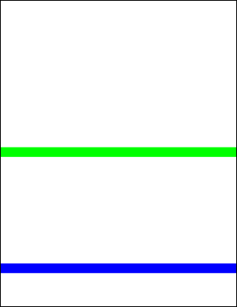

# AddLine Function

Adds a line to the current page.

## Syntax

[C#]

```csharp
int AddLine(double x1, double y1, double x2, double y2)int AddLine(double x1, double y1, double x2, double y2, LineEnding ending1, LineEnding ending2)int AddLine(double x1, double y1, double x2, double y2, LineEnding ending1, LineEnding ending2, double scale1, double scale2)
```

## Params

| **Name** | **Description** |
| --- | --- |
| x1 | The horizontal offset of the start point. |
| x2 | The horizontal offset of the end point. |
| y1 | The vertical offset of the start point. |
| y2 | The vertical offset of the end point. |
| ending1 | The line ending to be placed at the start of the line. Default is None. |
| ending2 | The line ending to be placed at the end of the line. Default is None. |
| scale1 | The scaling to be applied to the line ending at the start of the line. Default is 1.0. |
| scale2 | The scaling to be applied to the line ending at the end of the line. Default is 1.0. |
| return | The Object ID of the newly added Graphic Object. |

## Notes

Adds a line to the current page. The line is drawn in the current [color](2-properties/color.md) at the current [width](2-properties/width.md) and with the current [options](2-properties/options.md).

In addition to the line, you can also specify line endings such as arrows. These can be placed at at the start of the line, the end of the line or both.

The LineEnding enumeration may take the following values:

* None - No symbol
* Square - A square block
* Circle - A filled circle
* Diamond - A filled diamond
* OpenArrow - Two lines forming an arrow
* ClosedArrow - A triangular arrow
* Butt - A perpendicular line
* BigButt - A longer perpendicular line
* ReverseOpenArrow - The same as OpenArrow, but pointing backwards rather than forwards
* ReverseClosedArrow - The same as ClosedArrow, but pointing backwards rather than forwards
* Slash - A 30 degree line
* Arrowhead - A barbed arrowhead

The size of the line ending is proportional to the width of the line, but you can provide a further scaling factor to make it bigger or smaller.

The tip of each line ending is placed at the end of the line so that they can be used for precise positioning. Reversed line endings have a reversed direction, so while the tip is still at the end of the line, the body of the symbol will extend past the end of the line.

The AddLine function returns the Object ID of the newly added Graphic Object.

## Example

The following code adds two horizontal lines to a document. The first is blue and the second is green.

[C#]

```csharp
using var doc = new Doc();
doc.Width = 24;
doc.Color.String = "0 0 255";
doc.AddLine(-50, 100, 999, 100);
doc.Color.String = "0 255 0";
doc.AddLine(-50, 400, 999, 400);
doc.Save("docaddline.pdf");
```


docaddline.pdf

Also see example code in:

* [ABCpdf Advanced Graphics Example](4-examples/17-advancedgraphics.md)
* [Doc TopDown Property](2-properties/topdown.md)
* [Doc Width Property](2-properties/width.md).
