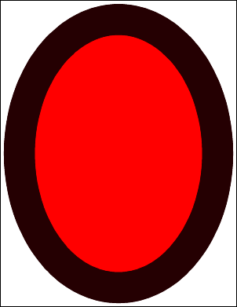

# AddOval Function

Adds an oval to the current page.

## Syntax

**[C#]**

```csharp
int AddOval(bool filled)
```

<span class=language>[Visual
            Basic]</span>  
`Function AddOval(filled As Boolean) As Integer`
## Params

| Name | Description | 
| --- | --- |
| filled | Whether to fill the oval rather than simply outline it. | 
| return | The Object ID of the newly added Graphic Object. | 

## Notes

Adds an oval to the current page. The oval is drawn in the current [color](../2-properties/color.md) at the current [width](../2-properties/width.md) and with the current [options](../2-properties/options.md). It is scaled to fill the current [rectangle](../2-properties/rect.md). The oval may be outlined or filled.

The AddOval function returns the Object ID of the newly added Graphic Object.

## Example

The following code adds two ovals to a document. The outline oval is semi-transparent.

[C#]

```csharp
using var doc = new Doc();
doc.Width = 80;
doc.Rect.Inset(50, 50);
doc.Color.String = "255 0 0";
doc.AddOval(true);
doc.Color.String = "0 255 0 128";
doc.AddOval(false);
doc.Save(Server.MapPath("docaddoval.pdf"));
```

<span class=language>[Visual Basic]</span>
```vbnet
Using doc As New Doc()
  doc.Width = 80
  doc.Rect.Inset(50, 50)
  doc.Color.String = "255 0 0"
  doc.AddOval(True)
  doc.Color.String = "0 255 0 128"
  doc.AddOval(False)
  doc.Save(Server.MapPath("docaddoval.pdf"))
End Using
```

docaddoval.pdf

Also see example code in: [XColor Components Property](../../xcolor/2-properties/components.md), [ColorSpace Gamma Property](../../../6-abcpdf.objects/colorspace/2-properties/gamma.md), [ColorSpace WhitePoint Property](../../../6-abcpdf.objects/colorspace/2-properties/whitepoint.md), [SwfImportOperation Import Function](../../../8-abcpdf.operations/5-swfimportoperation/1-methods/import.md).