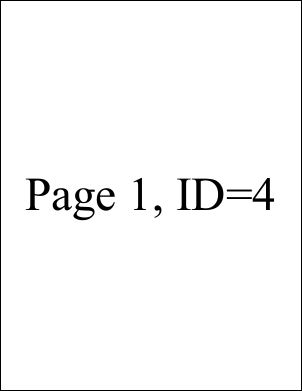

# AddPage Function

Adds a page to the current document.

## Syntax

## Params

| **Name** | **Description** |
| --- | --- |
| page | The page insertion location. By default, pages are added at the end of the document. |
| return | The Object ID of the newly added Page Object. |

## Notes

Adds a page to the current document.

The AddPage function returns the Object ID of the newly added Page Object. Typically, you will want to assign this return value to the document Page property using code of the form.

[C#] theDoc.Page = theDoc.AddPage();

Pages are added at the end of the document. However, you can use the page parameter to insert pages at other locations. The following code inserts a page at the start of a document.

[C#] theDoc.Page = theDoc.AddPage(1);

Any existing page and all subsequent pages will be shifted towards the end of the document to make room for the insertion.

## Example

The following code adds three pages to a document. Each page is marked with the page number and page Object ID.

[C#]

```csharp
using var doc = new Doc();
doc.FontSize = 96; // big text
doc.TextStyle.HPos = 0.5; // centered
doc.TextStyle.VPos = 0.5; // ...
for (int i = 1; i <= 3; i++) {
  doc.Page = doc.AddPage();
  string txt = $"Page {i}, ID={doc.Page}";
  doc.AddText(txt);
}
doc.Save("docaddpage.pdf");
```


docaddpage.pdf

