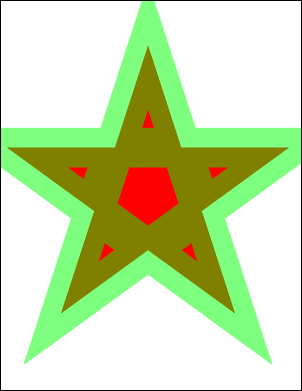

# AddPoly Function

Adds a polygon to the current page.

## Syntax

[C#]

```csharp
int AddPoly(string points, bool filled)int AddPoly(double[] points, bool filled)int AddPoly(double[] points, int index, int count, bool filled)
```

## Params

| **Name** | **Description** |
| --- | --- |
| points | The coordinates of the vertices of the polygon. |
| index | The index of the first coordinate into the array points. |
| count | The number of coordinates in the array points to use. |
| filled | Whether to fill the polygon rather than simply outline it. |
| return | The Object ID of the newly added Graphic Object. |

## Notes

Adds a polygon to the current page. The polygon is drawn in the current [color](2-properties/color.md) at the current [width](2-properties/width.md) and with the current [options](2-properties/options.md). The polygon may be outlined or filled.

The points string is a sequence of numbers representing the coordinates of the polygon. The string should be of the format "x1 y1 x2 y2 ... xN yN". The numbers may be delimited with spaces, commas or semicolons. If the first point is equal to the last then the path is closed before outlining.

The AddPoly function returns the Object ID of the newly added Graphic Object.

## Example

The following code adds a transparent green outlined star over the top of a red filled star.

[C#]

```csharp
using var doc = new Doc();
doc.Width = 80;
doc.Color.String = "255 0 0";
doc.AddPoly("124 158 300 700 476 158 15 493 585 493 124 158", true);
doc.Color.String = "0 255 0 a128";
doc.AddPoly("124 158 300 700 476 158 15 493 585 493 124 158", false);
doc.Save("docaddpoly.pdf");
```


docaddpoly.pdf

Also see example code in: [XRendering AntiAliasPolygons Property](xrendering/2-properties/antialiaspolygons.md).
