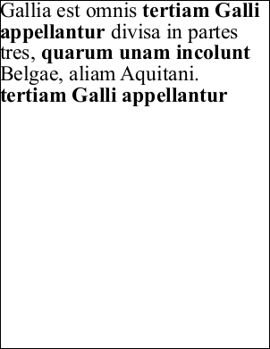

# AddText Function

Adds a block of single styled text to the current page.

## Syntax

[C#]

```csharp
int AddText(string text)
```

## Params

| **Name** | **Description** |
| --- | --- |
| text | The text to be added to the page. |
| return | The Object ID of the newly added Text Object. |

## Notes

Adds a block of single styled text to the current page.

For adding multi-styled text or for chaining text from one page to another you should use the [AddTextStyled](addtextstyled.md) method which is used for adding [styled text](3-concepts/b-htmlstyles.md).

The text is in the current [style](2-properties/font.md) [size](2-properties/fontsize.md) and [color](2-properties/color.md) and starts at the location specified in the current [position](2-properties/pos.md). If the text is long it will will wrap and extend downwards until it fills the current [rectangle](2-properties/rect.md). Text positioning in the rectangle is determined by the [horizontal](xtextstyle/2-properties/hpos.md) and [vertical](xtextstyle/2-properties/vpos.md) positioning.

You can chain together multiple text blocks so that text flows from one to the next. To do this you need to first add a block of text using AddText. Then add multiple new text blocks using [AddTextStyled](addtextstyled.md) each time passing in the ID obtained from the previous call after adjusting the target location (such as the rectangle or the page).

The AddText function returns the Object ID of the newly added Text Object. If no text could be added then zero is returned. This will happen if a zero length string was supplied or if the rectangle was too small for even one character to be displayed.

Typically you will get a return value of zero if your text was too large to fit in your [Rect](2-properties/rect.md) or if the [Pos](2-properties/pos.md) was at the end of the Rect. So if you are expecting text to be displayed and are seeing a return value of zero check your text size check your Rect is where you think it is by framing it using [FrameRect](framerect.md) and ensure your Pos is set at the top left of the Rect.

Text is drawn word-wrapped within the current rectangle with the first character at the location specified by the [Pos](2-properties/pos.md) property. Normally the [Pos](2-properties/pos.md) property reflects the top left position of the current rectangle. However if you need to alter the position at which text drawing starts you can modify the [Pos](2-properties/pos.md) property after changing the [Rect](2-properties/rect.md). When the text has been drawn the [Pos](2-properties/pos.md) will be updated to reflect the next text insertion point.

Character positioning is specified from the top left of the character. Please see [Pos](2-properties/pos.md) for details on positioning when using vertical fonts. The [FontSize](2-properties/fontsize.md) determines the total line height and the character baseline is 80% of the way down from the top of the line.

## Example

The following code adds a number of chunks of text to a document. Each chunk is in a different style. This sample makes use of the fact that the Pos is updated to point to the next text insertion point after adding a piece of text. However note that when inserting muti-styled text it is generally more efficient to use the [AddTextStyled](addtextstyled.md) method.

[C#]

```csharp
using var doc = new Doc();
doc.Page = doc.AddPage();
doc.FontSize = 48;
int font1 = doc.AddFont("Times-Roman");
int font2 = doc.AddFont("Times-Bold");
doc.Font = font1;
doc.AddText("Gallia est omnis ");
doc.Font = font2;
doc.AddText("tertiam Galli appellantur ");
doc.Font = font1;
doc.AddText("divisa in partes tres, ");
doc.Font = font2;
doc.AddText("quarum unam incolunt ");
doc.Font = font1;
doc.AddText("Belgae, aliam Aquitani. ");
doc.Font = font2;
doc.AddText("tertiam Galli appellantur");
doc.Save("docaddtext.pdf");
```


docaddtext.pdf

Also see example code in:

* [ABCpdf Deletion Example](4-examples/05-deletion.md)
* [ABCpdf Headers and Footers Example](4-examples/06-headers.md)
* [ABCpdf Landscape Example](4-examples/08-landscape.md)
* [ABCpdf Unicode Example](4-examples/12-unicode.md)
* [ABCpdf eForm Placeholder Example](4-examples/15-eform2.md)
* [ABCpdf eForm FDF Example](4-examples/16-eformfdf.md)
* [ABCpdf Advanced Graphics Example](4-examples/17-advancedgraphics.md)
* [ABCpdf Fields, Markup and Movies Example](4-examples/18-annotations.md)
* [Doc AddBookmark Function](addbookmark.md)
* [Doc AddColorSpaceFile Function](addcolorspacefile.md)
* [Doc AddColorSpaceSpot Function](addcolorspacespot.md)
* [Doc AddFont Function](addfont.md)
* [Doc AddPage Function](addpage.md)
* [Doc Append Function](append.md)
* [Doc EmbedFont Function](embedfont.md)
* [Doc Read Function](read.md)
* [Doc RemapPages Method](remappages.md)
* [Doc Save Function](save.md)
* [Doc Encryption Property](2-properties/encryption.md)
* [Doc Font Property](2-properties/font.md)
* [Doc FontSize Property](2-properties/fontsize.md)
* [Doc Page Property](2-properties/page.md)
* [Doc Pos Property](2-properties/pos.md)
* [Doc String Property](2-properties/string.md)
* [Doc TextStyle Property](2-properties/textstyle.md)
* [Doc TopDown Property](2-properties/topdown.md)
* [Doc Transform Property](2-properties/transform.md)
* [XColor Alpha Property](xcolor/2-properties/alpha.md)
* [XEncryption SetCryptMethods Function](xencryption/1-methods/setcryptmethods.md)
* [XHtmlOptions GetTagRects Function](xhtmloptions/1-methods/gettagrects.md)
* [XHtmlOptions HtmlCallback Property](xhtmloptions/2-properties/htmlcallback.md)
* [XPoint Point Property](xpoint/2-properties/point.md)
* [XRect Rectangle Property](xrect/2-properties/rectangle.md)
* [XRendering AntiAliasPolygons Property](xrendering/2-properties/antialiaspolygons.md)
* [XRendering AntiAliasText Property](xrendering/2-properties/antialiastext.md)
* [XRendering IccCmyk Property](xrendering/2-properties/icccmyk.md)
* [XRendering SaveAlpha Property](xrendering/2-properties/savealpha.md)
* [XTextStyle Bold Property](xtextstyle/2-properties/bold.md)
* [XTextStyle CharSpacing Property](xtextstyle/2-properties/charspacing.md)
* [XTextStyle HPos Property](xtextstyle/2-properties/hpos.md)
* [XTextStyle Indent Property](xtextstyle/2-properties/indent.md)
* [XTextStyle Italic Property](xtextstyle/2-properties/italic.md)
* [XTextStyle Justification Property](xtextstyle/2-properties/justification.md)
* [XTextStyle LeftMargin Property](xtextstyle/2-properties/leftmargin.md)
* [XTextStyle LineSpacing Property](xtextstyle/2-properties/linespacing.md)
* [XTextStyle Outline Property](xtextstyle/2-properties/outline.md)
* [XTextStyle ParaSpacing Property](xtextstyle/2-properties/paraspacing.md)
* [XTextStyle Size Property](xtextstyle/2-properties/size.md)
* [XTextStyle Strike Property](xtextstyle/2-properties/strike.md)
* [XTextStyle Strike2 Property](xtextstyle/2-properties/strike2.md)
* [XTextStyle Underline Property](xtextstyle/2-properties/underline.md)
* [XTextStyle VPos Property](xtextstyle/2-properties/vpos.md)
* [XTextStyle WordSpacing Property](xtextstyle/2-properties/wordspacing.md)
* [XTransform Invert Function](xtransform/1-methods/invert.md)
* [XTransform Magnify Function](xtransform/1-methods/magnify.md)
* [XTransform Reset Function](xtransform/1-methods/reset.md)
* [XTransform Rotate Function](xtransform/1-methods/rotate.md)
* [XTransform AngleUnit Property](xtransform/2-properties/angleunit.md)
* [FileSpecification FileSpecification Function](6-abcpdf.objects/filespecification/1-methods/filespecification.md)
* [FontObject Widths Property](6-abcpdf.objects/fontobject/2-properties/widths.md)
* [Page VectorizeText Function](6-abcpdf.objects/page/1-methods/vectorizetext.md)
* [Signature Validate Function](6-abcpdf.objects/signature/1-methods/validate.md)
* [ArrayAtom FromContentStream Function](7-abcpdf.atoms/arrayatom/1-methods/fromcontentstream.md)
* [XpsImportOperation Import Function](8-abcpdf.operations/4-xpsimportoperation/1-methods/import.md)
* [SwfImportOperation Import Function](8-abcpdf.operations/5-swfimportoperation/1-methods/import.md)
* [WebPageOperation Doc Property](8-abcpdf.operations/Q-webpageoperation/2-properties/01-doc.md).
