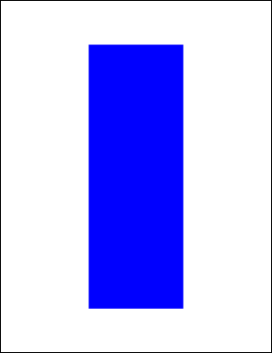

# FillRect Function

Adds a painted rectangle to the current page.

## Syntax

**[C#]**

```csharp
int FillRect()
int FillRect(double radiusX, double radiusY)
```

<span class=language>[Visual
            Basic]</span>  

```
Function FillRect() As Integer
Function FillRect(radiusX As Double, radiusY As Double) As Integer
```

## Params

| Name | Description | 
| --- | --- |
| radiusX | The horizontal radius to use for rounded corners. | 
| radiusY | The vertical radius to use for rounded corners. | 
| return | The Object ID of the newly added Graphic Object. | 

## Notes

Adds a painted rectangle to the current page. The rectangle location and size is determined by the current [rectangle](../2-properties/rect.md), the fill color is determined by the current [color](../2-properties/color.md)and any options are determined by the current [options](../2-properties/options.md).

By specifying values for the horizontal and vertical radius parameters you can draw rectangles with rounded corners. The values refer to the radii of the ellipse used to draw the corners.

By setting the horizontal radius parameter to half the width of the rect and the vertical radius parameter to half the height of the rect you can draw filled ovals and circles.

The FillRect function returns the Object ID of the newly added Graphic Object.

## Example

The following code adds a blue filled rectangle to a document. The frame is inset from the edges of the document by 200 points horizontally and 100 points vertically.

[C#]

```csharp
using var doc = new Doc();
doc.Rect.Inset(200, 100);
doc.Color.Blue = 255;
doc.FillRect();
doc.Save(Server.MapPath("docfillrect.pdf"));
```

<span class=language>[Visual
            Basic]</span>
```vbnet
Using doc As New Doc()
  doc.Rect.Inset(200, 100)
  doc.Color.Blue = 255
  doc.FillRect()
  doc.Save(Server.MapPath("docfillrect.pdf"))
End Using
```

docfillrect.pdf

Also see example code in: [ABCpdf eForm Placeholder Example](../../../4-examples/15-eform2.md), [ABCpdf Advanced Graphics Example](../../../4-examples/17-advancedgraphics.md), [Doc AddImageBitmap Function](addimagebitmap.md), [Doc AddImageObject Function](addimageobject.md), [Doc AddXObject Function](addxobject.md), [Doc Color Property](../2-properties/color.md), [XHtmlOptions HideBackground Property](../../xhtmloptions/2-properties/hidebackground.md), [XImage SetMask Function](../../ximage/1-methods/setmask.md), [XRendering SaveAlpha Property](../../xrendering/2-properties/savealpha.md), [Page GetBitmap Function](../../../6-abcpdf.objects/page/1-methods/getbitmap.md), [PixMap SetChromakey Function](../../../6-abcpdf.objects/pixmap/1-methods/setchromakey.md).