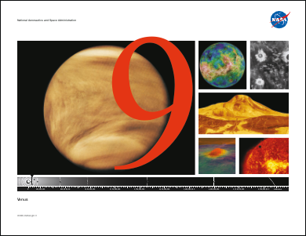
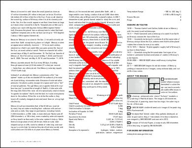
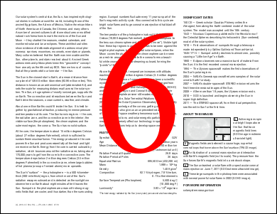

# RemapPages Method

Remaps pages for reordering, copying and deletion.

## Syntax

**[C#]**

```csharp
void RemapPages(string pages)
void RemapPages(int[] pages)
void RemapPages(int[] pages, int index, int count)
```

<span class=language>[Visual
            Basic]</span>  

```
Sub RemapPages(pages As String)
Sub RemapPages(pages() As Integer)
Sub RemapPages(pages() As Integer, index As Integer, count As Integer)
```

## Params

| Name | Description | 
| --- | --- |
| pages | The list of page numbers. | 
| index | The index of the first page number into the array pages. | 
| count | The number of page numbers in the array pages to use. | 

## Notes

This method provides a simple method for remapping the pages in a document. It can be used for reordering, copying or deleting pages.

It accepts a list of page numbers and reorders the pages in the document so that they match these page numbers. If a number is repeated more than once, the page is duplicated. If a number is omitted, the page is deleted.

Page numbers can be delimited using spaces, commas or semicolons. The first page in a document is page one. So to reverse a four page document, you might use "4 3 2 1".

If a page is duplicated and it contains [Form](../../xform/default.md) fields, you may want to call [MakeFieldsUnique](../../xform/1-methods/makefieldsunique.md) to avoid sharing fields across pages.

## Example

The following code snippet illustrates how one might reverse all the pages in a document.

[C#]

```csharp
using var doc = new Doc();
doc.Read(Server.MapPath("../mypics/sample.pdf"));
doc.FontSize = 500;
doc.Color.String = "255 0 0";
doc.TextStyle.HPos = 0.5;
doc.TextStyle.VPos = 0.3;
int count = doc.PageCount;
var pages = new List();
for (int i = 1; i <= count; i++) {
  doc.PageNumber = i;
  doc.AddText(i.ToString());
  pages.Add(count - i + 1);
}
doc.RemapPages(pages.ToArray());
doc.Save(Server.MapPath("docremappages.pdf"));
```

<span class=language>[Visual Basic]</span>
```vbnet
Using doc As New Doc()
  doc.Read(Server.MapPath("../mypics/sample.pdf"))
  doc.FontSize = 500
  doc.Color.String = "255 0 0"
  doc.TextStyle.HPos = 0.5
  doc.TextStyle.VPos = 0.3
  Dim theCount As Integer = doc.PageCount
  Dim pages As New List(Of Integer)()
  Dim i As Integer = 1
  While i <= theCount
    doc.PageNumber = i
    doc.AddText(i.ToString())
    pages.Add(theCount - i + 1)
    System.Math.Max(System.Threading.Interlocked.Increment(i),i - 1)
  End While
  doc.RemapPages(pages.ToArray())
  doc.Save(Server.MapPath("docremappages.pdf"))
End Using
```

docremappages.pdf [Page 1]docremappages.pdf [Page 2]docremappages.pdf [Page 3]docremappages.pdf [Page 4]Also see example code in: [OpAtom Find Function](../../../7-abcpdf.atoms/opatom/1-methods/find.md).