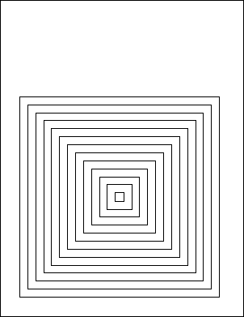

# Rect Property

| Type | Default | Read Only | Description | 
| --- | --- | --- | --- |
| **[C#]** ```csharp XRect ``` [Visual Basic] `XRect` | The dimensions of the current page. | No | The current rectangle used for drawing operations. | 

## Notes

This property determines the current rectangle. This is used by a number of operations including [AddText](../1-methods/addtext.md), [AddImage](../1-methods/addimage.md), [FrameRect](../1-methods/framerect.md) and [FillRect](../1-methods/fillrect.md).

The [XRect](../../xrect/default.md) object represents a rectangular area in two-dimensional space. The properties of the [XRect](../../xrect/default.md) object represent the bottom left and top right corners of the area.

AddText adds text within the current rectangle wrapping the text at the edges. The AddImage methods add an image scaled to fill the current rectangle. FrameRect frames the current rectangle and FillRect fills the current rectangle.

When you change this property the [Pos](pos.md) property is reset to point to the top left of the Rect.

XRect is a class not a struct. Unlike System.Drawing Rectangle and RectangleF the XRect is a class rather than a struct. This means that variables are passed by reference rather than value - you may have more than one reference to the same object. As such you need to be careful not to over share. For example the following is wrong,

```csharp
theDoc.Rect = theDoc.MediaBox; // incorrect
```

The reason it is incorrect is because you are now sharing one rectangle between two properties - if you change the Rect you also change the MediaBox. Suppose you change the Rect, add some text, then add a new page. Because the Rect has changed, the MediaBox has also changed, and when you add a new page it will likely be the wrong size.

Instead you want something more like one of these,

```csharp
theDoc.Rect = theDoc.MediaBox.Clone(); // correcttheDoc.Rect.String = theDoc.MediaBox.String; // also correct
```

## Example

The following code creates a PDF document containing a number of concentric frames.

[C#]

```csharp
using var doc = new Doc();
doc.Rect.String = "50 50 550 550";
for (int i = 1; i <= 20; i++) {
  doc.FrameRect();
  doc.Rect.Inset(20, 20);
}
doc.Save(Server.MapPath("docrect.pdf"));
```

**[Visual Basic]**

```vbnet
Using doc As New Doc()
  doc.Rect.String = "50 50 550 550"
  Dim i As Integer = 1
  While i <= 20
    doc.FrameRect()
    doc.Rect.Inset(20, 20)
    System.Math.Max(System.Threading.Interlocked.Increment(i),i - 1)
  End While
  doc.Save(Server.MapPath("docrect.pdf"))
End Using
```

 docrect.pdf

Also see example code in: [ABCpdf Text Flow Example](../../../4-examples/02-textflow.md), [ABCpdf Text Flow Round Image Example](../../../4-examples/02-textflow2.md), [ABCpdf Multistyle Example](../../../4-examples/03-multistyled.md), [ABCpdf Image Example](../../../4-examples/04-image.md), [ABCpdf Headers and Footers Example](../../../4-examples/06-headers.md), [ABCpdf Landscape Example](../../../4-examples/08-landscape.md), [ABCpdf Small Table Example](../../../4-examples/09-table1.md), [ABCpdf Large Table Example](../../../4-examples/10-table2.md), [ABCpdf Paged HTML Example](../../../4-examples/13-pagedhtml.md), [ABCpdf eForm Placeholder Example](../../../4-examples/15-eform2.md), [ABCpdf eForm FDF Example](../../../4-examples/16-eformfdf.md), [ABCpdf Advanced Graphics Example](../../../4-examples/17-advancedgraphics.md), [ABCpdf PDF Rendering Example](../../../4-examples/19-rendering.md), [Doc AddColorSpaceFile Function](../1-methods/addcolorspacefile.md), [Doc AddColorSpaceSpot Function](../1-methods/addcolorspacespot.md), [Doc AddImageBitmap Function](../1-methods/addimagebitmap.md), [Doc AddImageDoc Function](../1-methods/addimagedoc.md), [Doc AddImageFile Function](../1-methods/addimagefile.md), [Doc AddImageObject Function](../1-methods/addimageobject.md), [Doc AddImageToChain Function](../1-methods/addimagetochain.md), [Doc AddOval Function](../1-methods/addoval.md), [Doc AddPie Function](../1-methods/addpie.md), [Doc AddXObject Function](../1-methods/addxobject.md), [Doc FillRect Function](../1-methods/fillrect.md), [Doc FrameRect Function](../1-methods/framerect.md), [Doc ColorSpace Property](colorspace.md), [Doc String Property](string.md), [Doc TextStyle Property](textstyle.md), [Doc TopDown Property](topdown.md), [Doc Transform Property](transform.md), [XColor Alpha Property](../../xcolor/2-properties/alpha.md), [XColor Components Property](../../xcolor/2-properties/components.md), [XHtmlOptions GetTagRects Function](../../xhtmloptions/1-methods/gettagrects.md), [XHtmlOptions LinkDestinations Method](../../xhtmloptions/1-methods/linkdestinations.md), [XHtmlOptions LinkPages Method](../../xhtmloptions/1-methods/linkpages.md), [XHtmlOptions HtmlCallback Property](../../xhtmloptions/2-properties/htmlcallback.md), [XImage SetData Function](../../ximage/1-methods/setdata.md), [XImage SetFile Function](../../ximage/1-methods/setfile.md), [XImage SetMask Function](../../ximage/1-methods/setmask.md), [XImage SetStream Function](../../ximage/1-methods/setstream.md), [XImage Selection Property](../../ximage/2-properties/selection.md), [XRect Rectangle Property](../../xrect/2-properties/rectangle.md), [XRendering AntiAliasImages Property](../../xrendering/2-properties/antialiasimages.md), [XRendering AntiAliasPolygons Property](../../xrendering/2-properties/antialiaspolygons.md), [XRendering AntiAliasText Property](../../xrendering/2-properties/antialiastext.md), [XRendering ColorSpace Property](../../xrendering/2-properties/colorspace.md), [XRendering DefaultHalftone Property](../../xrendering/2-properties/defaulthalftone.md), [XRendering DrawAnnotations Property](../../xrendering/2-properties/drawannotations.md), [XRendering IccCmyk Property](../../xrendering/2-properties/icccmyk.md), [XRendering SaveCompression Property](../../xrendering/2-properties/savecompression.md), [XTextStyle Bold Property](../../xtextstyle/2-properties/bold.md), [XTextStyle CharSpacing Property](../../xtextstyle/2-properties/charspacing.md), [XTextStyle HPos Property](../../xtextstyle/2-properties/hpos.md), [XTextStyle Indent Property](../../xtextstyle/2-properties/indent.md), [XTextStyle Italic Property](../../xtextstyle/2-properties/italic.md), [XTextStyle Justification Property](../../xtextstyle/2-properties/justification.md), [XTextStyle Kerning Property](../../xtextstyle/2-properties/kerning.md), [XTextStyle LeftMargin Property](../../xtextstyle/2-properties/leftmargin.md), [XTextStyle LineSpacing Property](../../xtextstyle/2-properties/linespacing.md), [XTextStyle Outline Property](../../xtextstyle/2-properties/outline.md), [XTextStyle ParaSpacing Property](../../xtextstyle/2-properties/paraspacing.md), [XTextStyle Strike Property](../../xtextstyle/2-properties/strike.md), [XTextStyle Strike2 Property](../../xtextstyle/2-properties/strike2.md), [XTextStyle Underline Property](../../xtextstyle/2-properties/underline.md), [XTextStyle VPos Property](../../xtextstyle/2-properties/vpos.md), [XTextStyle WordSpacing Property](../../xtextstyle/2-properties/wordspacing.md), [XTransform Invert Function](../../xtransform/1-methods/invert.md), [XTransform Magnify Function](../../xtransform/1-methods/magnify.md), [XTransform Reset Function](../../xtransform/1-methods/reset.md), [XTransform Skew Function](../../xtransform/1-methods/skew.md), [XTransform Translate Function](../../xtransform/1-methods/translate.md), [ColorSpace Gamma Property](../../../6-abcpdf.objects/colorspace/2-properties/gamma.md), [ColorSpace WhitePoint Property](../../../6-abcpdf.objects/colorspace/2-properties/whitepoint.md), [FontObject Widths Property](../../../6-abcpdf.objects/fontobject/2-properties/widths.md), [Page GetBitmap Function](../../../6-abcpdf.objects/page/1-methods/getbitmap.md), [Page Rotation Property](../../../6-abcpdf.objects/page/2-properties/rotation.md), [PixMap SetAlpha Function](../../../6-abcpdf.objects/pixmap/1-methods/setalpha.md), [PixMap SetChromakey Function](../../../6-abcpdf.objects/pixmap/1-methods/setchromakey.md), [PixMap ToGrayscale Function](../../../6-abcpdf.objects/pixmap/1-methods/tograyscale.md), [ArrayAtom FromContentStream Function](../../../7-abcpdf.atoms/arrayatom/1-methods/fromcontentstream.md), [XpsImportOperation Import Function](../../../8-abcpdf.operations/4-xpsimportoperation/1-methods/import.md), [SwfImportOperation Import Function](../../../8-abcpdf.operations/5-swfimportoperation/1-methods/import.md), [TextOperation Group Function](../../../8-abcpdf.operations/8-textoperation/1-methods/group.md), [WebPageOperation Doc Property](../../../8-abcpdf.operations/Q-webpageoperation/2-properties/01-doc.md).