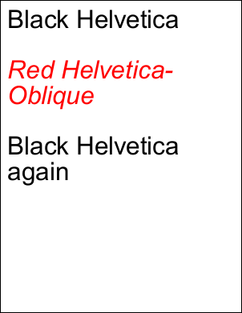

# String Property

| Type | Default Value | Read Only | Description | 
| --- | --- | --- | --- |
| **[C#]** ```csharp string ``` [Visual Basic] `String` | Variable | No | A string representation of the graphic style of the document | 

## Notes

A string representation of the graphic style of the document.

This covers the [Transform](transform.md), [ColorSpace](colorspace.md), [Color](color.md), [Font](font.md), [TextStyle](textstyle.md), [Width](width.md) and [Options](options.md) properties. However it does not cover the [Page](page.md), [Layer](layer.md), [Rect](rect.md) or [Pos](pos.md) properties.

## Example

In this example we show how to use the String property to implement a graphics state stack with Push and Pop operators.

[C#]

```csharp
using var doc = new Doc();
doc.FontSize = 64;
doc.Rect.Inset(20, 20);
doc.Font = doc.AddFont("Helvetica");
var state = new Stack();
state.Push(doc.String);
doc.AddText("Black Helvetica\r\n\r\n");
doc.Color.SetRgb(255, 0, 0);
doc.Font = doc.AddFont("Helvetica-Oblique");
doc.AddText("Red Helvetica-Oblique\r\n\r\n");
doc.String = state.Pop();
doc.AddText("Black Helvetica again\r\n\r\n");
doc.Save(Server.MapPath("savestate.pdf"));
```

<span class=language>[Visual Basic]</span>
```vbnet
Using doc As New Doc()
  doc.FontSize = 64
  doc.Rect.Inset(20, 20)
  doc.Font = doc.AddFont("Helvetica")
  Dim state As New Stack(Of String)()
  state.Push(doc.String)
  doc.AddText("Black Helvetica" & vbCr & vbLf & vbCr & vbLf)
  doc.Color.SetRgb(255, 0, 0)
  doc.Font = doc.AddFont("Helvetica-Oblique")
  doc.AddText("Red Helvetica-Oblique" & vbCr & vbLf & vbCr & vbLf)
  doc.String = state.Pop()
  doc.AddText("Black Helvetica again" & vbCr & vbLf & vbCr & vbLf)
  doc.Save(Server.MapPath("savestate.pdf"))
End Using
```

 savestate.pdf