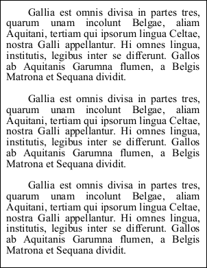

# TextStyle Property

| Type | Default | Read Only | Description | 
| --- | --- | --- | --- |
| **[C#]** ```csharp XTextStyle ``` [Visual Basic] `XTextStyle` | Ten point text. | No | The current style for drawing text. | 

## Notes

This property determines the current style settings used for adding text.

## Example

The following code creates a PDF document and adds some text using a number of the text style properties to control formatting.

[C#]

```csharp
using var doc = new Doc();
string text = "Gallia est omnis divisa in partes tres, quarum unam incolunt Belgae, aliam Aquitani, tertiam qui ipsorum lingua Celtae, nostra Galli appellantur. Hi omnes lingua, institutis, legibus inter se differunt. Gallos ab Aquitanis Garumna flumen, a Belgis Matrona et Sequana dividit.";
text = text + "\r\n" + text + "\r\n" + text + "\r\n";
doc.Rect.Inset(20, 20);
doc.TextStyle.Size = 32;
doc.TextStyle.Justification = 1;
doc.TextStyle.Indent = 64;
doc.TextStyle.ParaSpacing = 32;
doc.AddText(text);
doc.Save(Server.MapPath("doctextstyle.pdf"));
```

**[Visual Basic]**

```vbnet
Using doc As New Doc()
  Dim theText As String = "Gallia est omnis divisa in partes tres, quarum unam incolunt Belgae, aliam Aquitani, tertiam qui ipsorum lingua Celtae, nostra Galli appellantur. Hi omnes lingua, institutis, legibus inter se differunt. Gallos ab Aquitanis Garumna flumen, a Belgis Matrona et Sequana dividit."
  theText = theText + vbCr & vbLf + theText + vbCr & vbLf + theText + vbCr & vbLf
  doc.Rect.Inset(20, 20)
  doc.TextStyle.Size = 32
  doc.TextStyle.Justification = 1
  doc.TextStyle.Indent = 64
  doc.TextStyle.ParaSpacing = 32
  doc.AddText(theText)
  doc.Save(Server.MapPath("doctextstyle.pdf"))
End Using
```

 doctextstyle.pdf

Also see example code in: [ABCpdf Text Flow Example](../../../4-examples/02-textflow.md), [ABCpdf Text Flow Round Image Example](../../../4-examples/02-textflow2.md), [ABCpdf Deletion Example](../../../4-examples/05-deletion.md), [ABCpdf Headers and Footers Example](../../../4-examples/06-headers.md), [Doc AddPage Function](../1-methods/addpage.md), [Doc Append Function](../1-methods/append.md), [Doc Read Function](../1-methods/read.md), [Doc RemapPages Method](../1-methods/remappages.md), [XRendering SaveAlpha Property](../../xrendering/2-properties/savealpha.md), [XTextStyle Bold Property](../../xtextstyle/2-properties/bold.md), [XTextStyle CharSpacing Property](../../xtextstyle/2-properties/charspacing.md), [XTextStyle HPos Property](../../xtextstyle/2-properties/hpos.md), [XTextStyle Indent Property](../../xtextstyle/2-properties/indent.md), [XTextStyle Italic Property](../../xtextstyle/2-properties/italic.md), [XTextStyle Justification Property](../../xtextstyle/2-properties/justification.md), [XTextStyle Kerning Property](../../xtextstyle/2-properties/kerning.md), [XTextStyle LeftMargin Property](../../xtextstyle/2-properties/leftmargin.md), [XTextStyle LineSpacing Property](../../xtextstyle/2-properties/linespacing.md), [XTextStyle Outline Property](../../xtextstyle/2-properties/outline.md), [XTextStyle ParaSpacing Property](../../xtextstyle/2-properties/paraspacing.md), [XTextStyle Size Property](../../xtextstyle/2-properties/size.md), [XTextStyle Strike Property](../../xtextstyle/2-properties/strike.md), [XTextStyle Strike2 Property](../../xtextstyle/2-properties/strike2.md), [XTextStyle Underline Property](../../xtextstyle/2-properties/underline.md), [XTextStyle VPos Property](../../xtextstyle/2-properties/vpos.md), [XTextStyle WordSpacing Property](../../xtextstyle/2-properties/wordspacing.md), [XTransform Rotate Function](../../xtransform/1-methods/rotate.md), [XTransform AngleUnit�Property](../../xtransform/2-properties/angleunit.md), [FontObject Widths Property](../../../6-abcpdf.objects/fontobject/2-properties/widths.md), [Page GetBitmap Function](../../../6-abcpdf.objects/page/1-methods/getbitmap.md), [XpsImportOperation Import Function](../../../8-abcpdf.operations/4-xpsimportoperation/1-methods/import.md), [SwfImportOperation Import Function](../../../8-abcpdf.operations/5-swfimportoperation/1-methods/import.md).