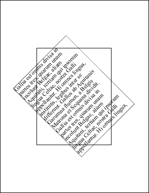

# Transform Property

| Type | Default | Read Only | Description | 
| --- | --- | --- | --- |
| **[C#]** ```csharp XTransform ``` [Visual Basic] `XTransform` | No transformation. | No | The current transformation for drawing. | 

## Notes

This property determines the current world space transform. It affects any drawing using the [AddText](../1-methods/addtext.md), [AddImage](../1-methods/addimage.md), [AddLine](../1-methods/addline.md), [FrameRect](../1-methods/framerect.md) and [FillRect](../1-methods/fillrect.md) methods.

Transforms are general operations which encompass rotation, translation, magnification and skewing or a combination of these. Note that the order in which transforms are applied is significant: a rotation followed by a translation is not the same as a translation followed by a rotation.

A world space transform is not same an object transform. You are changing the coordinate system - not the objects you're inserting.

Note that transforms operate on the underlying PDF coordinate space rather than any abstraction specified by the [Units](units.md) and [TopDown](topdown.md) properties. If you are using transforms you will find it easiest to work in the native PDF coordinate space.

## Example

The following code creates a PDF document and adds some text and a rectangle rotated at 45 degrees anti-clockwise around the middle of the document.

[C#]

```csharp
using var doc = new Doc();
string text = "Gallia est omnis divisa in partes tres, quarum unam incolunt Belgae, aliam Aquitani, tertiam qui ipsorum lingua Celtae, nostra Galli appellantur. Hi omnes lingua, institutis, legibus inter se differunt. Gallos ab Aquitanis Garumna flumen, a Belgis Matrona et Sequana dividit.";
text = text + "\r\n" + text + "\r\n" + text + "\r\n";
doc.Rect.Magnify(0.5, 0.5);
doc.Rect.Position(151, 198);
doc.FrameRect();
doc.Transform.Rotate(45, 302, 396);
doc.FrameRect();
doc.FontSize = 24;
doc.AddText(text);
doc.Save(Server.MapPath("doctransform.pdf"));
```

**[Visual Basic]**

```vbnet
Using doc As New Doc()
  Dim theText As String
  theText = "Gallia est omnis divisa in partes tres, quarum unam incolunt Belgae, aliam Aquitani, tertiam qui ipsorum lingua Celtae, nostra Galli appellantur. Hi omnes lingua, institutis, legibus inter se differunt. Gallos ab Aquitanis Garumna flumen, a Belgis Matrona et Sequana dividit."
  theText = theText + vbCr & vbLf + theText + vbCr & vbLf + theText + vbCr & vbLf
  doc.Rect.Magnify(0.5, 0.5)
  doc.Rect.Position(151, 198)
  doc.FrameRect()
  doc.Transform.Rotate(45, 302, 396)
  doc.FrameRect()
  doc.FontSize = 24
  doc.AddText(theText)
  doc.Save(Server.MapPath("doctransform.pdf"))
End Using
```

 doctransform.pdf

Also see example code in: [ABCpdf Landscape Example](../../../4-examples/08-landscape.md), [Doc AddGrid Function](../1-methods/addgrid.md), [Doc AddXObject Function](../1-methods/addxobject.md), [XTransform Invert Function](../../xtransform/1-methods/invert.md), [XTransform Magnify Function](../../xtransform/1-methods/magnify.md), [XTransform Reset Function](../../xtransform/1-methods/reset.md), [XTransform Rotate Function](../../xtransform/1-methods/rotate.md), [XTransform Skew Function](../../xtransform/1-methods/skew.md), [XTransform Translate Function](../../xtransform/1-methods/translate.md), [XTransform AngleUnit�Property](../../xtransform/2-properties/angleunit.md), [FontObject Widths Property](../../../6-abcpdf.objects/fontobject/2-properties/widths.md), [Page GetBitmap Function](../../../6-abcpdf.objects/page/1-methods/getbitmap.md), [Page MakeFormXObject Function](../../../6-abcpdf.objects/page/1-methods/makeformxobject.md), [Page Rotation Property](../../../6-abcpdf.objects/page/2-properties/rotation.md), [XpsImportOperation Import Function](../../../8-abcpdf.operations/4-xpsimportoperation/1-methods/import.md).