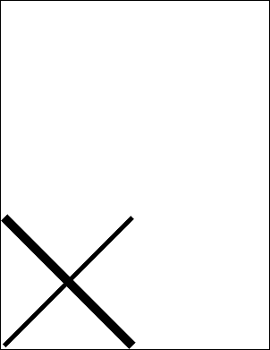

# Width Property

| Type | Default | Read Only | Description | 
| --- | --- | --- | --- |
| **[C#]** ```csharp double ``` [Visual Basic] `Double` | 1.0 | No | The current line width. | 

## Notes

The width determines the width of lines drawn using methods like [AddLine](../1-methods/addline.md) and [FrameRect](../1-methods/framerect.md). The width is measured in the current [Units](units.md).

The AddLine method creates lines centered on the points you provide. This means if you draw a horizontal line with a width of ten the line will extend five points above your start position and five points below it.

The FrameRect method draws lines outside the rectangle you provide. So if you frame a rectangle using a width of ten, the drawn rectangle will extend ten points above, below, to the left and to the right of your specified rectangle. No drawing will fall within the rectangle.

## Example

The following code adds two lines to a document. The first line has a width of ten points and the second has a width of twenty points.

[C#]

```csharp
using var doc = new Doc();
doc.Width = 10;
doc.AddLine(10, 10, 300, 300);
doc.Width = 20;
doc.AddLine(10, 300, 300, 10);
doc.Save(Server.MapPath("docwidth.pdf"));
```

**[Visual Basic]**

```vbnet
Using doc As New Doc()
  doc.Width = 10
  doc.AddLine(10, 10, 300, 300)
  doc.Width = 20
  doc.AddLine(10, 300, 300, 10)
  doc.Save(Server.MapPath("docwidth.pdf"))
End Using
```

 docwidth.pdf

Also see example code in: [ABCpdf Text Flow Example](../../../4-examples/02-textflow.md), [ABCpdf Text Flow Round Image Example](../../../4-examples/02-textflow2.md), [ABCpdf Advanced Graphics Example](../../../4-examples/17-advancedgraphics.md), [Doc AddArc Function](../1-methods/addarc.md), [Doc AddLine Function](../1-methods/addline.md), [Doc AddOval Function](../1-methods/addoval.md), [Doc AddPie Function](../1-methods/addpie.md), [Doc AddPoly Function](../1-methods/addpoly.md), [Doc Options Property](options.md), [Doc TopDown Property](topdown.md), [XColor Components Property](../../xcolor/2-properties/components.md), [XTransform Skew Function](../../xtransform/1-methods/skew.md), [XTransform Translate Function](../../xtransform/1-methods/translate.md), [ColorSpace Gamma Property](../../../6-abcpdf.objects/colorspace/2-properties/gamma.md), [ColorSpace WhitePoint Property](../../../6-abcpdf.objects/colorspace/2-properties/whitepoint.md), [Page GetBitmap Function](../../../6-abcpdf.objects/page/1-methods/getbitmap.md), [ImageOperation GetImageProperties Function](../../../8-abcpdf.operations/9-imageoperation/1-methods/getimageproperties.md).