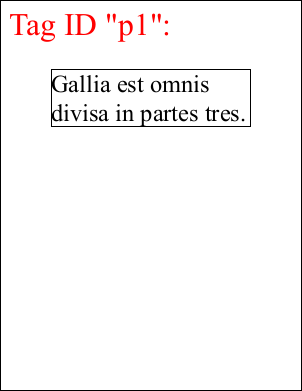

# GetTagRects Function

Gets an array of the locations of tagged visible items.

## Syntax

[C#]

```csharp
<a href="../../xrect/default.htm">XRect</a>[] GetTagRects(int id)
```

## Params

| **Name** | **Description** |
| --- | --- |
| id | The Object ID of the object. |
| return | The location of tagged visible HTML objects. |

## Notes

Use this method to retrieve the locations of tagged visible items. The locations are to be used with [Doc.Transform](doc/2-properties/transform.md) being identity.

To use this method you need to enable the tagging functionality. See the [AddTags](2-properties/addtags.md) property for details.

This function takes an ID obtained from a call to [Doc.AddImageUrl, ](doc/1-methods/addimageurl.md)[Doc.AddImageHtml](doc/1-methods/addimagehtml.md) or [Doc.AddImageToChain](doc/1-methods/addimagetochain.md) and returns the locations of any items which are visible on the PDF page as a result of that call.

The locations match up directly on a one-to-one basis with the IDs returned by the [GetTagIDs](gettagids.md) function.

## Example

The following example shows the effect that this parameter has on HTML rendering.

[C#]

```csharp
using var doc = new Doc();
doc.Rect.Inset(100, 100);
doc.Rect.Top = 700;
doc.HtmlOptions.Engine = EngineType.Chrome123;
doc.HtmlOptions.AddTags = true;
// The ABCGecko and MSHTML tagging format uses styles.
string html1 = "<!DOCTYPE html><html><head>" +
  "<style type='text/css'>" +
  ".tag-visible { abcpdf-tag-visible:true; outline: 1px solid transparent; font-size: 72pt; }" +
  "</style>" +
  "</head><body>" +
  "<p id='p1' class='tag-visible'>Gallia est omnis divisa in partes tres.</p>" +
  "</body></html>";
// The ABCChrome tagging format uses attributes.
string html2 = "<!DOCTYPE html><html><head>" +
  "<style type='text/css'>" +
  "p { font-size: 72pt; }" +
  "</style>" +
  "</head><body>" +
  "<p id='p1' abcpdf-tag-visible>Gallia est omnis divisa in partes tres.</p>" +
  "</body></html>";
string html = doc.HtmlOptions.Engine != EngineType.Chrome123 ? html1 : html2;
int id = doc.AddImageHtml(html);
// Frame location of the tagged element
var tagRects = doc.HtmlOptions.GetTagRects(id);
foreach (var rect in tagRects) {
  doc.Rect.String = rect.ToString();
  doc.FrameRect();
}
// Output tag ID
var tagIds = doc.HtmlOptions.GetTagIDs(id);
doc.Rect.String = doc.MediaBox.String;
doc.Rect.Inset(20, 20);
doc.FontSize = 64;
doc.Color.String = "255 0 0";
doc.AddText($"Tag ID \"{tagIds[0]}\":");
// Save the document
doc.Save("HtmlOptionsGetTagRects.pdf");
```


HtmlOptionsGetTagRects.pdf

