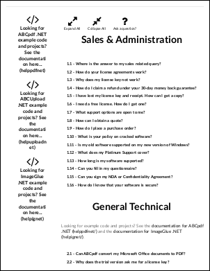

# LinkPages Method

Convert external links to internal links wherever possible.

## Syntax

**[C#]**

```csharp
void LinkPages()
void LinkPages(bool inPageNavigation)
```

<span class=language>[Visual
            Basic]</span>  

```
Sub LinkPages()
Sub LinkPages(inPageNavigation as Boolean)
```

## Params

| Name | Description | 
| --- | --- |
| inPageNavigation | If true then links will target particular locations on the destination page, if false then they will target just the page. Default false. | 
| return | n/a. | 

## Notes

This method scans the entire document converting external links to internal links wherever possible. As an alternative you can restrict the scope of the conversion by using the [LinkDestinations](linkdestinations.md) method.

By default, links in rendered HTML are preserved as is. This means that links in a web page link to external URLs. When you click on them, a browser window will be launched and the original target of the link displayed.

In some situations, you may wish to resolve links within the document so that they take you between pages in the PDF rather than launching an external browser window.

For example, you might add a number of web pages which contain links to each other. Rather than linking to the pages on the original web site, you might like to resolve the links so that they point at the pages as they now appear in the PDF.

Similarly, if you use named destinations (HTML fragments) with links within the document, you will may wish to use this method to convert them from external links to internal ones. If you do this you will probably want to set the [AddIDs](../2-properties/addids.md) and [AddNames](../2-properties/addnames.md) properties to true to ensure that this type of fragment destination is tracked.

## Example

This example shows how to import an HTML page which uses named destinations.

We first create a [Doc](../default.md) object and inset the edges a little so that the HTML will appear in the middle of the page. We assign the appropriate HTML options so that links will be rendered live.

[C#]

```csharp
using var doc = new Doc();
doc.Rect.Inset(18, 18);
doc.HtmlOptions.AddLinks = true;
```

<span class=language>[Visual
            Basic]</span>
```vbnet
Using doc As New Doc()
  doc.Rect.Inset(18, 18)
  doc.HtmlOptions.AddLinks = True
```

We add the pages to the document.

[C#]

```csharp
int id = doc.AddImageUrl("http://www.websupergoo.com/support.htm");
while (true) {
  if (!doc.Chainable(id))
    break;
  doc.Page = doc.AddPage();
  id = doc.AddImageToChain(id);
}
```

<span class=language>[Visual Basic]</span>
```vbnet
Dim theID As Integer = doc.AddImageUrl("http://www.websupergoo.com/support.htm")
While True
  If Not doc.Chainable(theID) Then
    Exit While
  End If
  doc.Page = doc.AddPage()
  theID = doc.AddImageToChain(theID)
End While
```

The URL we've referenced makes extensive use of named destinations. We want these named destination links to take us between pages on the PDF rather than taking us to the original URL.

After adding the pages, we can flatten them. We can't do this until after the pages have been added because flattening will invalidate our previous ID and break the chain.

[C#]

```csharp
doc.HtmlOptions.LinkPages();
for (int i = 1; i <= doc.PageCount; i++) {
  doc.PageNumber = i;
  doc.Flatten();
}
```

<span class=language>[Visual
            Basic]</span>
```vbnet
doc.HtmlOptions.LinkPages()
Dim i As Integer = 1
While i <= doc.PageCount
  doc.PageNumber = i
  doc.Flatten()
  System.Math.Max(System.Threading.Interlocked.Increment(i),i - 1)
End While
```

Finally, we save.

[C#]

```csharp
doc.Save(Server.MapPath("linkpages.pdf"));
```

<span class=language>[Visual
            Basic]</span>
```vbnet
doc.Save(Server.MapPath("linkpages.pdf"))
End Using
```

We get the following output. The links work – where possible – within the PDF.

linkpages.pdf [Page 1]linkpages.pdf [Page 2]Also see example code in: [XHtmlOptions UseScript Property](../2-properties/usescript.md).