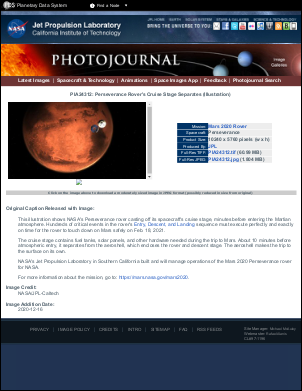

# BrowserWidth Property

| Type | Default Value | Read Only | Description | 
| --- | --- | --- | --- |
| **[C#]** ```csharp int ``` [Visual Basic] `Integer` | 0 | No | The width of the virtual browser in pixels. | 

## Notes

### For ABCChrome, MSHtml and ABCWebKit engines

This property determines or reflects the virtual browser width when rendering HTML.

HTML documents do not have a predefined width and height. The width of an HTML document varies as the client resizes the browser. How far the content flows down the page is dependent on the width of the browser.

The Width parameter is used to control this aspect of HTML rendering. It is exactly as if you were displaying your HTML in a browser window the same width as the supplied value. Typical values might be 800 or 1024.

If the Width is zero then the web page view will default to a size which shows all the available content without needing to scroll from left to right. You can use this default to ensure that all your HTML content is visible.

When the Width is zero the [InitialWidth](initialwidth.md) property is used as a minimum sensible width. The page may get wider to ensure that content is not clipped, however it will not get smaller than this value.

The ABCChrome engine relies on JavaScript to determine an appropriate with, so if you set the [UseScript](usescript.md) property to false, it will fall back to the [InitialWidth](initialwidth.md) value.

### For Gecko engine

This value determines the paper width, in pixels, to use while doing layout in Gecko.

Since the Gecko engine always renders in a paginated context and never needs to scroll, contents that horizontally exceed this value will often be reflown vertically.

For example, a sidebar using the CSS float property may appear below the "main content area" if the paper is not wide enough to accommodate both items.

If the value is zero then the paper width will be determined using the dimensions of the current [Doc.Rect](../../doc/2-properties/rect.md).

## Example

The following example shows the effect that this parameter has on PDF rendering.

[C#]

```csharp
using var doc = new Doc();
string url = "https://photojournal.jpl.nasa.gov/catalog/PIA24312";
// Render html page with default browser width
doc.AddImageUrl(url);
// Save the document
doc.Save(Server.MapPath("HtmlOptionsBrowserWidth0.pdf"));
doc.Clear();
// Render html page with browser width = 300
doc.HtmlOptions.BrowserWidth = 300;
doc.AddImageUrl(url);
// Save the document
doc.Save(Server.MapPath("HtmlOptionsBrowserWidth300.pdf"));
```

**[Visual Basic]**

```vbnet
Using doc As New Doc()
  Dim theURL As String = "https://photojournal.jpl.nasa.gov/catalog/PIA24312"
  ' Render html page with default browser width
  doc.AddImageUrl(theURL)
  ' Save the document
  doc.Save(Server.MapPath("HtmlOptionsBrowserWidth0.pdf"))
  doc.Clear()
  ' Render html page with browser width = 300
  doc.HtmlOptions.BrowserWidth = 300
  doc.AddImageUrl(theURL)
  ' Save the document
  doc.Save(Server.MapPath("HtmlOptionsBrowserWidth300.pdf"))
End Using
```

 HtmlOptionsBrowserWidth0.pdf

 HtmlOptionsBrowserWidth300.pdf