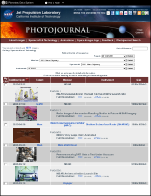
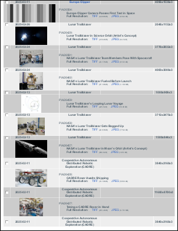

# UseScript Property

| Type | Default Value | Read Only | Description | 
| --- | --- | --- | --- |
| **[C#]** ```csharp bool ``` [Visual Basic] `Boolean` | true | No | Whether to enable JavaScript and VBScript. | 

## Notes

This property determines whether JavaScript and VBScript are enabled.

By default client-side script such as JavaScript is enabled when rendering HTML documents. You may wish to change this default setting for performance or security reasons.

The ABCChrome engine relies on JavaScript for HTML analysis. If you disable it the [HtmlOptions.Media](media.md), [HtmlOptions.AddForms](addforms.md), [HtmlOptions.AddTags](addtags.md) and [HtmlOptions.OnLoadScript](onloadscript.md) will cease to operate. In addition the [HtmlOptions.BrowserWidth](browserwidth.md) zero setting, which allows the page autosize behavior, will default to the [HtmlOptions.InitialWidth](initialwidth.md) setting.

If you have a server edition of Windows (e.g. Windows Server 2008) and are using the MSHTML engine, you may need to also disable Enhanced Security Configuration for user running the program/application pool to allow JavaScript execution.

Script-Accessible Functions and Properties. These are functions and properties that script inside HTML can access. The function signatures shown are in C#-like syntax. You'll need to pass in the correct number of arguments.

**window.external.ABCpdf_RenderWait** &ndash; Delays ABCpdf's rendering of the HTML page.
## Syntax

## Params

| Name | Description | 
| --- | --- |
| return | True if ABCpdf waits (i.e. the function succeeds), otherwise false. | 

## Notes

When this function is called before the page load is considered
                      complete, the page load is not considered complete until ABCpdf_RenderComplete
                      is called. This function returns false if ABCpdf_RenderComplete has been called.
                      This is useful if the page relies on timeout/asynchronous events (AJAX).**window.external.ABCpdf_RenderComplete** &ndash; Resumes ABCpdf's rendering of the HTML page.
## Syntax

## Params

| Name | Description | 
| --- | --- |
| force | Whether ABCpdf ignores normal indications of page load completion. The default value is false. | 
| return | True if ABCpdf resumes rendering as requested (i.e. the function succeeds), otherwise false. | 

## Notes

This function can be called whether ABCpdf_RenderWait
                      has/has not been called. If force is false, ABCpdf resumes normal rendering.
                      If force is true, ABCpdf starts rendering immediately, ignoring all other
                      indications of page load completion. This function returns false if force
                      is false and the function has been previously called with force true.
                      This is useful if the page relies on timeout/asynchronous events (AJAX).
## Examples

[C#]

```csharp
Doc doc = new Doc();
doc.HtmlOptions.Engine = EngineType.MSHtml;
doc.HtmlOptions.UseScript = true;

// Render after 3 seconds
doc.HtmlOptions.OnLoadScript = "(function(){"
  + " window.external.ABCpdf_RenderWait();"
  + " setTimeout(function(){ window.external.ABCpdf_RenderComplete(); }, 3000);"
  + "})();";

doc.AddImageUrl("http://www.websupergoo.com");
doc.Save(Server.MapPath("wsg.pdf"));
```

**[Visual Basic]**

```vbnet
Dim theDoc As Doc = New Doc()
theDoc.HtmlOptions.Engine = EngineType.MSHtml
theDoc.HtmlOptions.UseScript = True

' Render after 3 seconds
theDoc.HtmlOptions.OnLoadScript = "(function(){" _
  & " window.external.ABCpdf_RenderWait();" _
  & " setTimeout(function(){ window.external.ABCpdf_RenderComplete(); }, 3000);" _
  & "})();"

theDoc.AddImageUrl("http://www.websupergoo.com")
theDoc.Save(Server.MapPath("wsg.pdf"))
```

**window.ABCpdf_go** &ndash; Specifies whether ABCpdf proceeds to render the HTML page.
## Syntax

## Params

| Value | Description | 
| --- | --- |
| undefined (initial value), true | ABCpdf proceeds to render the HTML page. | 
| false | ABCpdf waits. | 

## Notes

UseScript has to be true and
                      [OnLoadScript](onloadscript.md) has to be non-empty for this
                      property to be effectual. ABCpdf will wait for this property to be either
                      undefined or true before rendering the HTML page. The whole HTML rendering
                      operation is still subject to the [Timeout](timeout.md) property's value.
                      Usually, this property is set to false in OnLoadScript and is also set
                      to true in an event listener added in OnLoadScript. If assignments to
                      this property are provided in both OnLoadScript
                      and the script in the web page, please refer to the notes in
                      [OnLoadScript](onloadscript.md) for the order of execution.
## Examples

[C#]

```csharp
Doc doc = new Doc();
doc.HtmlOptions.Engine = EngineType.Gecko;
doc.HtmlOptions.UseScript = true;

// Render after 3 seconds
doc.HtmlOptions.OnLoadScript = "(function(){"
  + " window.ABCpdf_go = false;"
  + " setTimeout(function(){ window.ABCpdf_go = true; }, 3000);"
  + "})();";

doc.AddImageUrl("http://www.websupergoo.com");
doc.Save(Server.MapPath("wsg.pdf"));
```

**[Visual Basic]**

```vbnet
Dim theDoc As Doc = New Doc()
theDoc.HtmlOptions.Engine = EngineType.Gecko
theDoc.HtmlOptions.UseScript = True

' Render after 3 seconds
theDoc.HtmlOptions.OnLoadScript = "(function(){" _
  & " window.ABCpdf_go = false;" _
  & " setTimeout(function(){ window.ABCpdf_go = true; }, 3000);" _
  & "})();"

theDoc.AddImageUrl("http://www.websupergoo.com")
theDoc.Save(Server.MapPath("wsg.pdf"))
```

**ABCChromeExt.Render()** &ndash; Triggers immediate conversion of the HTML page.
## Syntax

[C#]

```csharp
void ABCChromeExt.Render();
```

**[Visual Basic]**

```vbnet
Private Sub Render()
```

## Params

| Value | Description | 
| --- | --- |
| n/a | n/a | 

## Notes

Calling the method ABCChromeExt.Render() in any JavaScript executed within an HTML page will force the immediate rendering of the page to PDF without delay.

This option cannot be used in HtmlOptions.OnLoadScript - no error will occur but processing will not be curtailed.

You will need to set a sensible value for HtmlOptions.RenderDelay to allow processing to continue past the OnLoad event.

## Example

The following example shows one method of crawling and transferring an entire site to PDF. Here, we use JavaScript to determine the links present on the page. However, you could equally well use the [HtmlCallback](htmlcallback.md) to do the same thing.

[C#]

```csharp
using var doc = new Doc();
string uri = "https://photojournal.jpl.nasa.gov/gallery/snt";
// Set HTML options
doc.HtmlOptions.AddLinks = true;
doc.HtmlOptions.UseScript = true;
doc.HtmlOptions.PageCacheEnabled = false;
// JavaScript is used to extract all links from the page
doc.HtmlOptions.OnLoadScript = "var hrefCollection = document.all ? document.all.tags(\"a\") : document.getElementsByTagName(\"a\");" +
  "var allLinks = \"\";" +
  "for(i = 0; i  0)" +
  "  allLinks += \",\";" +
  "allLinks += hrefCollection.item(i).href;" +
  "};" +
  "document.documentElement.abcpdf = allLinks;";
// Array of links - start with base URL
var links = new ArrayList();
links.Add(uri);
for (int i = 0; i  20)
    break;
  // Add page
  doc.Page = doc.AddPage();
  int id = doc.AddImageUrl(links[i] as string);
  // Links from the rendered page
  string allLinks = doc.HtmlOptions.GetScriptReturn(id);
  string[] newLinks = allLinks.Split(new char[] { ',' });
  foreach (string link in newLinks) {
    // Check to see if we allready rendered this page
    if (links.BinarySearch(link)  0 && links.BinarySearch(link.Substring(0, pos)) >= 0)) {
        if (link.StartsWith(uri)) {
          links.Add(link);
        }
      }
    }
  }
  // Add other pages
  while (true) {
    doc.FrameRect();
    if (!doc.Chainable(id))
      break;
    doc.Page = doc.AddPage();
    id = doc.AddImageToChain(id);
  }
}
// Link pages together
doc.HtmlOptions.LinkPages();
// Flatten all pages
for (int i = 1; i <= doc.PageCount; i++) {
  doc.PageNumber = i;
  doc.Flatten();
}
// Save the document
doc.Save(Server.MapPath("HtmlOptionsJavaScript.pdf"));
```

**[Visual Basic]**

```vbnet
Using doc As New Doc()
  Dim theURL As String = "https://photojournal.jpl.nasa.gov/gallery/snt"
  ' Set HTML options
  doc.HtmlOptions.AddLinks = True
  doc.HtmlOptions.UseScript = True
  doc.HtmlOptions.PageCacheEnabled = False
  ' JavaScript is used to extract all links from the page
  doc.HtmlOptions.OnLoadScript = "var hrefCollection = document.all ? document.all.tags(""a"") : document.getElementsByTagName(""a"");" + "var allLinks = """";" + "for(i = 0; i  0)" + vbTab & "allLinks += "","";" + "allLinks += hrefCollection.item(i).href;" + "};" + "document.documentElement.abcpdf = allLinks;"
  ' Array of links - start with base URL
  Dim links As New ArrayList()
  links.Add(theURL)
  Dim i As Integer = 0
  While i  20 Then
      Exit While
    End If
    ' Add page
    doc.Page = doc.AddPage()
    Dim theID As Integer = doc.AddImageUrl(TryCast(links(i), String))
    ' Links from the rendered page
    Dim allLinks As String = doc.HtmlOptions.GetScriptReturn(theID)
    Dim newLinks As String() = allLinks.Split(New Char() {","C})
    For Each link As String In newLinks
      ' Check to see if we allready rendered this page
      If links.BinarySearch(link)  0 AndAlso links.BinarySearch(link.Substring(0, pos)) >= 0) Then
          If link.StartsWith(theURL) Then
            links.Add(link)
          End If
        End If
      End If
    Next
    ' Add other pages
    While True
      doc.FrameRect()
      If Not doc.Chainable(theID) Then
        Exit While
      End If
      doc.Page = doc.AddPage()
      theID = doc.AddImageToChain(theID)
    End While
    System.Math.Max(System.Threading.Interlocked.Increment(i),i - 1)
  End While
  ' Link pages together
  doc.HtmlOptions.LinkPages()
  ' Flatten all pages
  Dim i As Integer = 1
  While i <= doc.PageCount
    doc.PageNumber = i
    doc.Flatten()
    System.Math.Max(System.Threading.Interlocked.Increment(i),i - 1)
  End While
  ' Save the document
  doc.Save(Server.MapPath("HtmlOptionsJavaScript.pdf"))
End Using
```


                  HtmlOptionsJavaScript.pdf - [Page 1]
                  HtmlOptionsJavaScript.pdf - [Page 2]
                  HtmlOptionsJavaScript.pdf - [Page 3]
                  HtmlOptionsJavaScript.pdf - [Page 4]Also see example code in: [ABCpdf Paged HTML Example](../../../4-examples/13-pagedhtml.md).