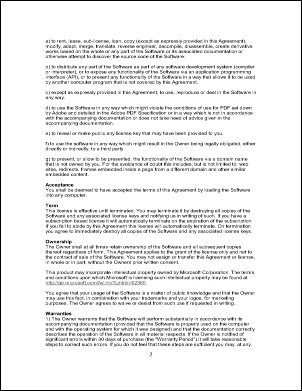
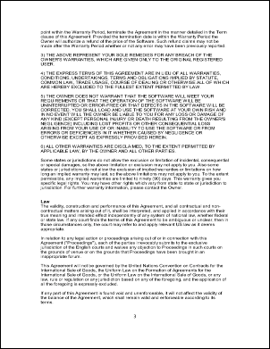

# Frame Property

| Type | Default | Read Only | Description | 
| --- | --- | --- | --- |
| **[C#]** ```csharp int ``` [Visual Basic] `Integer` | 1 | No | The currently selected frame. | 

## Notes

Some file formats can contain more than one image. The [FrameCount](framecount.md) property reflects the number of images.

You can change the currently selected image using the Frame property. As you change the frame the [Width](width.md), [Height](height.md), [HRes](hres.md) and [VRes](vres.md) properties will change to reflect the dimensions and resolution of the currently selected image. When you add an Image using the [Doc.AddImageObject](../../doc/1-methods/addimageobject.md) method the currently selected frame is added.

Flash (SWF) movies contain a number of frames. You can set the current frame using this property. If you set this property to a negative number it indicates the number of milliseconds (rather than frames) into the movie.

## Example

Here we open a TIFF file using the XImage object. We then scan through
            each of the images within the file and insert them into a new page
            of our PDF document.
            [C#]

```csharp
using var img = new XImage();
using var doc = new Doc();
img.SetFile(Server.MapPath("../mypics/multipage.tif"));
for (int i = 1; i <= img.FrameCount; i++) {
  img.Frame = i;
  doc.Page = doc.AddPage();
  doc.AddImageObject(img, false);
}
doc.Save(Server.MapPath("imageframe.pdf"));
```

**[Visual Basic]**

```vbnet
Dim theImg As New XImage()
Dim doc As New Doc()
theImg.SetFile(Server.MapPath("../mypics/multipage.tif"))
Dim i As Integer = 1
While i <= theImg.FrameCount
  theImg.Frame = i
  doc.Page = doc.AddPage()
  doc.AddImageObject(theImg, False)
  System.Math.Max(System.Threading.Interlocked.Increment(i),i - 1)
End While
theImg.Clear()
doc.Save(Server.MapPath("imageframe.pdf"))
doc.Clear()
```

 imageframe.pdf - [Page 1]

 imageframe.pdf - [Page 2]