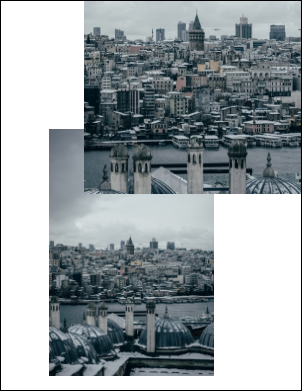

# Selection Property

| Type | Default | Read Only | Description | 
| --- | --- | --- | --- |
| **[C#]** ```csharp XRect ``` [Visual Basic] `XRect` | The dimensions of the current frame. | No | The current selection rectangle. | 

## Notes

You may wish to add only a portion of an image. By changing the selection rectangle you can specify different areas to be added.

Note that this property only has an effect on an Image if the [Indirect](indirect.md) property is true (which is generally the case).

## Example

Here we open a TIFF file using the XImage object. We add the entire
            image to the document and then just a portion of the image using the
            Selection property.
            [C#]

```csharp
using var img = new XImage();
using var doc = new Doc();
img.SetFile(Server.MapPath("../mypics/mypic.jpg"));
doc.Rect.String = img.Selection.String;
doc.Rect.Magnify(0.5, 0.5);
doc.Rect.Position(100, 30);
doc.AddImageObject(img, false);
img.Selection.Inset(100, 200);
doc.Rect.String = img.Selection.String;
doc.Rect.Position(170, 400);
doc.AddImageObject(img, false);
doc.Save(Server.MapPath("imageselect.pdf"));
```

**[Visual Basic]**

```vbnet
Dim theImg As New XImage()
Dim doc As New Doc()
theImg.SetFile(Server.MapPath("../mypics/mypic.jpg"))
doc.Rect.String = theImg.Selection.[String]
doc.Rect.Magnify(0.5, 0.5)
doc.Rect.Position(100, 30)
doc.AddImageObject(theImg, False)
theImg.Selection.Inset(100, 200)
doc.Rect.String = theImg.Selection.[String]
doc.Rect.Position(170, 400)
doc.AddImageObject(theImg, False)
theImg.Clear()
doc.Save(Server.MapPath("imageselect.pdf"))
doc.Clear()
```

 imageselect.pdf