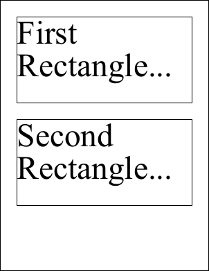

# Rectangle Property

| Type | Default | Read Only | Description | 
| --- | --- | --- | --- |
| **[C#]** ```csharp Rectangle ``` [Visual Basic] `Rectangle` | n/a | No | The System.Drawing.Rectangle. | 

## Notes

The rectangle as a System.Drawing Rectangle.

Windows coordinates are measured in distances from the top left of the drawing surface while PDF coordinates are measured from the bottom left.

So when you use this property the coordinates must be re-mapped. This needs to be done in the context of a containing object. Properties such as the [Doc.Rect](../../doc/2-properties/rect.md) and the [XImage.Selection](../../ximage/2-properties/selection.md) have containers but others such as the [Doc.MediaBox](../../doc/2-properties/mediabox.md) do not. In these cases the rectangles are assumed to contain themselves.

You may find it easier to work with .NET Rectangles than PDF rectangles. However remember that operations such as [Transforms](../../xtransform/default.md) work on the underlying PDF coordinates and not on the abstracted Windows coordinates.

## Example

The following code adds two blocks of text to a document. The positioning is done using standard .NET Rectangles.

[C#]

```csharp
using var doc = new Doc();
doc.FontSize = 96;
var rc = doc.MediaBox.Rectangle;
rc.Inflate(-50, -50);
rc.Height = 250;
doc.Rect.Rectangle = rc;
doc.FrameRect();
doc.AddText("First Rectangle...");
rc.Offset(0, 300);
doc.Rect.Rectangle = rc;
doc.FrameRect();
doc.AddText("Second Rectangle...");
doc.Save(Server.MapPath("xrectrectangle.pdf"));
```

**[Visual Basic]**

```vbnet
Using doc As New Doc()
  doc.FontSize = 96
  Dim rc As Rectangle = doc.MediaBox.Rectangle
  rc.Inflate(-50, -50)
  rc.Height = 250
  doc.Rect.Rectangle = rc
  doc.FrameRect()
  doc.AddText("First Rectangle...")
  rc.Offset(0, 300)
  doc.Rect.Rectangle = rc
  doc.FrameRect()
  doc.AddText("Second Rectangle...")
  doc.Save(Server.MapPath("xrectrectangle.pdf"))
End Using
```

 xrectrectangle.pdf