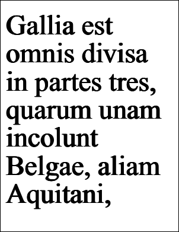

# Bold Property

| Type | Default | Read Only | Description | 
| --- | --- | --- | --- |
| **[C#]** ```csharp bool ``` [Visual Basic] `Boolean` | false | No | Whether to apply a synthetic bold effect. | 

## Notes

This property determines whether a synthetic bold effect is applied to text.

It is generally better to specify a bold typeface rather than synthesize a bold effect using the current typeface. However under some circumstances this may not be possible and you may prefer to apply a synthetic bold effect.

## Example

In this example we add some bold text to a document.

[C#]

```csharp
using var doc = new Doc();
string text = "Gallia est omnis divisa in partes tres, quarum unam incolunt Belgae, aliam Aquitani, tertiam qui ipsorum lingua Celtae, nostra Galli appellantur.";
doc.Rect.Inset(20, 40);
doc.TextStyle.Size = 96;
doc.TextStyle.Bold = true;
doc.AddText(text);
doc.Save(Server.MapPath("stylebold.pdf"));
```

**[Visual Basic]**

```vbnet
Using doc As New Doc()
  Dim theText As String
  theText = "Gallia est omnis divisa in partes tres, quarum unam incolunt Belgae, aliam Aquitani, tertiam qui ipsorum lingua Celtae, nostra Galli appellantur."
  doc.Rect.Inset(20, 40)
  doc.TextStyle.Size = 96
  doc.TextStyle.Bold = True
  doc.AddText(theText)
  doc.Save(Server.MapPath("stylebold.pdf"))
End Using
```

 stylebold.pdf