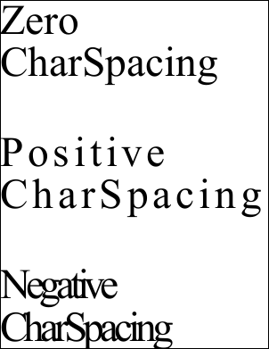

# CharSpacing Property

| **Type** | **Default** | **Read Only** | **Description** |
| --- | --- | --- | --- |
|  | 0.0 | No | The inter-character spacing. |

## Notes

This property controls the spacing between each character. It is sometimes called tracking but should not be confused with [kerning](kerning.md) which is slightly different.

Each character in a string of text has a width which is used for positioning the next character. The CharSpacing is added to the width of each character.

In the horizontal writing mode, specifying a positive value has the effect of stretching out the text. Specifying negative values has the effect of condensing the text. In the vertical writing mode, positive values condense the text, and negative values stretch out the text. See the [FontObject.WritingMode](6-abcpdf.objects/fontobject/2-properties/writingmode.md) property.

Because this property is measured as an absolute value measured in points, the visual effect will be greater if your text is smaller.

## Example

In this example we add three blocks of text to a document. The first block uses the default spacing. The second block uses a positive value to stretch out the text. The last block uses a negative value to condense the text.

[C#]

```csharp
using var doc = new Doc();
doc.TextStyle.Size = 96;
doc.AddText("Zero CharSpacing");
doc.Rect.Move(0, -300);
doc.TextStyle.CharSpacing = 10;
doc.AddText("Positive CharSpacing");
doc.Rect.Move(0, -300);
doc.TextStyle.CharSpacing = -10;
doc.AddText("Negative CharSpacing");
doc.Save("stylecspace.pdf");
```


stylecspace.pdf

