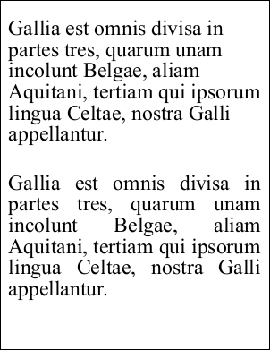

# Justification Property

| Type | Default | Read Only | Description | 
| --- | --- | --- | --- |
| **[C#]** ```csharp double ``` [Visual Basic] `Double` | 0.0 | No | The horizontal justification factor. | 

## Notes

Allows you to adjust the horizontal justification.

Every line of text is drawn within a bounding box determined by the [Doc.Rect](../../doc/2-properties/rect.md) property. The justification property can be used to space out words so that they fit the bounding box exactly.

Typically you will only need to use values of zero - no justification - and one - full justification. However intermediate values can be used to partially justify text.

As each line is drawn the difference between the width of the line and the width of the bounding box is evaluated to determine the amount of free width. This free width is divided by the number of space characters in the line and then multiplied by the justification factor to produce an inter-word spacing for the line. Lines at the end of paragraphs are not justified.

Text alignment is determined by the [TextStyle.HPos](hpos.md) and [TextStyle.VPos](vpos.md) properties.

## Example

In this example we add two blocks of text to a document. The first is added with no justification and the second is added with a justification factor of one.

[C#]

```csharp
using var doc = new Doc();
string text = "Gallia est omnis divisa in partes tres, quarum unam incolunt Belgae, aliam Aquitani, tertiam qui ipsorum lingua Celtae, nostra Galli appellantur.";
doc.Rect.Inset(20, 40);
doc.TextStyle.Size = 48;
doc.AddText(text);
doc.Rect.Move(0, -350);
doc.TextStyle.Justification = 1.0;
doc.AddText(text);
doc.Save(Server.MapPath("stylejustification.pdf"));
```

**[Visual Basic]**

```vbnet
Using doc As New Doc()
  Dim theText As String = "Gallia est omnis divisa in partes tres, quarum unam incolunt Belgae, aliam Aquitani, tertiam qui ipsorum lingua Celtae, nostra Galli appellantur."
  doc.Rect.Inset(20, 40)
  doc.TextStyle.Size = 48
  doc.AddText(theText)
  doc.Rect.Move(0, -350)
  doc.TextStyle.Justification = 1.0
  doc.AddText(theText)
  doc.Save(Server.MapPath("stylejustification.pdf"))
End Using
```

 stylejustification.pdf

Also see example code in: [ABCpdf Text Flow Example](../../../4-examples/02-textflow.md), [ABCpdf Text Flow Round Image Example](../../../4-examples/02-textflow2.md), [Doc TextStyle Property](../../doc/2-properties/textstyle.md).