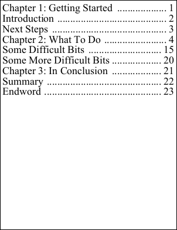

# Kerning Property

| Type | Default Value | Read Only | Description | 
| --- | --- | --- | --- |
| **[C#]** ```csharp KerningType ``` [Visual Basic] `KerningType` | Default | No | The kerning method. | 

## Notes

The kerning method.

Kerning is similar to [character spacing](charspacing.md) in that it controls how far apart two characters are. However rather than being a constant, it is a value which is determined by the two characters themselves. So the kerning for "tt" would likely be different than for "te".

The KerningType enumeration may take the following values:

- None
- Default

The default kerning method is based around the kerning tables in the TrueType font file. Not all fonts contain kerning tables so not all fonts will kern.

## Example

The following shows how to insert a table of contents while disabling kerning.

<span class=language>[C#]</span>  

              </p>
```csharp
string text = File.ReadAllText(Server.MapPath("tableofcontents.txt"));
text = text.Replace("\r", ""); // make our carriage returns into breaks
text = text.Replace(" ", "     "); // make our indent at start of line into nbsp
using var doc = new Doc();
doc.TextStyle.Size = 36;
doc.TextStyle.Kerning = XTextStyle.KerningType.None;
doc.Rect.Inset(10, 10);
doc.Page = doc.AddPage();
doc.AddTextStyled(text.Replace(" ~", "."));
doc.Save(Server.MapPath("TableOfContentsWithLeaders.pdf"));
```

<span class=language>[Visual Basic]</span>
```vbnet
Dim text As String = File.ReadAllText(Server.MapPath("tableofcontents.txt"))
text = text.Replace(vbCr, "")
' make our carriage returns into breaks
text = text.Replace(" ", vbTab & vbTab & " ")
' make our indent at start of line into nbsp
Using doc As New Doc()
  doc.TextStyle.Size = 36
  doc.TextStyle.Kerning = XTextStyle.KerningType.None
  doc.Rect.Inset(10, 10)
  doc.Page = doc.AddPage()
  doc.AddTextStyled(text.Replace(" ~", "."))
  doc.Save(Server.MapPath("TableOfContentsWithLeaders.pdf"))
End Using
```

Using the following input text.

``` Chapter 1: Getting Started ~1 Introduction ~2 Next Steps ~3 Chapter 2: What To Do ~4 Some Difficult Bits ~15 Some More Difficult Bits ~20 Chapter 3: In Conclusion ~21 Summary ~22 Endword ~23 ``` We get the following output.

 TableOfContentsWithLeaders.pdf

Also see example code in: [FontObject Widths Property](../../../6-abcpdf.objects/fontobject/2-properties/widths.md).