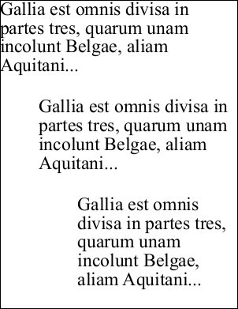

# LeftMargin Property

| Type | Default | Read Only | Description | 
| --- | --- | --- | --- |
| **[C#]** ```csharp double ``` [Visual Basic] `Double` | 0 | No | The paragraph indent. | 

## Notes

Allows you to apply a left margin to a block of text.

The left margin is a horizontal indent applied to every line of text. You can achieve the same effect by insetting the left of the current [Rect](../../doc/2-properties/rect.md) but using this property can be more convenient.

If the value is positive the block is shifted to the right by the specified number of units. If the value is negative it is shifted to the left by the specified number of units.

## Example

In the following example we add three blocks of text to a document. The first block uses the default left margin. The subsequent blocks use different left margin settings to indent the text.

[C#]

```csharp
using var doc = new Doc();
string text = "Gallia est omnis divisa in partes tres, quarum unam incolunt Belgae, aliam Aquitani...";
doc.TextStyle.Size = 48;
doc.AddText(text);
doc.Rect.Move(0, -250);
doc.TextStyle.LeftMargin = 100;
doc.AddText(text);
doc.Rect.Move(0, -250);
doc.TextStyle.LeftMargin = 200;
doc.AddText(text);
doc.Save(Server.MapPath("stylemargin.pdf"));
```

**[Visual Basic]**

```vbnet
Using doc As New Doc()
  Dim theText As String = "Gallia est omnis divisa in partes tres, quarum unam incolunt Belgae, aliam Aquitani..."
  doc.TextStyle.Size = 48
  doc.AddText(theText)
  doc.Rect.Move(0, -250)
  doc.TextStyle.LeftMargin = 100
  doc.AddText(theText)
  doc.Rect.Move(0, -250)
  doc.TextStyle.LeftMargin = 200
  doc.AddText(theText)
  doc.Save(Server.MapPath("stylemargin.pdf"))
End Using
```

 stylelmargin.pdf