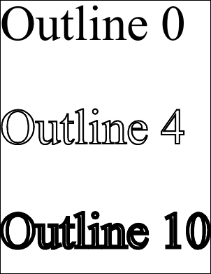

# Outline Property

| Type | Default | Read Only | Description | 
| --- | --- | --- | --- |
| **[C#]** ```csharp double ``` [Visual Basic] `Double` | 0 | No | The width of character outlining. | 

## Notes

This property determines whether a character outlining style is applied and the weight of the outline.

If the outline property is zero no outlining is done. If the outline property is greater than zero it indicates the width of lines used to outline the text.

## Example

In this example we add some text to a document varying the outline style to show how different values affect the final result.

[C#]

```csharp
using var doc = new Doc();
doc.TextStyle.Size = 144;
doc.AddText("Outline 0");
doc.Rect.Move(0, -300);
doc.TextStyle.Outline = 4;
doc.AddText("Outline 4");
doc.Rect.Move(0, -300);
doc.TextStyle.Outline = 10;
doc.AddText("Outline 10");
doc.Save(Server.MapPath("styleoutline.pdf"));
```

**[Visual Basic]**

```vbnet
Using doc As New Doc()
  doc.TextStyle.Size = 144
  doc.AddText("Outline 0")
  doc.Rect.Move(0, -300)
  doc.TextStyle.Outline = 4
  doc.AddText("Outline 4")
  doc.Rect.Move(0, -300)
  doc.TextStyle.Outline = 10
  doc.AddText("Outline 10")
  doc.Save(Server.MapPath("styleoutline.pdf"))
End Using
```

 styleoutline.pdf