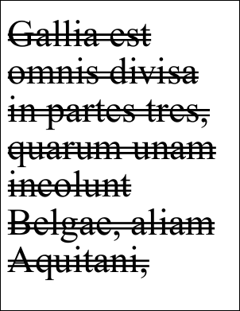

# Strike2 Property

| Type | Default | Read Only | Description | 
| --- | --- | --- | --- |
| **[C#]** ```csharp bool ``` [Visual Basic] `Boolean` | false | No | Whether to apply a double strikethrough effect. | 

## Notes

This property determines whether a double strikethrough is applied to text.

## Example

In this example we add some double strikethrough styled text to a document.

[C#]

```csharp
using var doc = new Doc();
string text = "Gallia est omnis divisa in partes tres, quarum unam incolunt Belgae, aliam Aquitani, tertiam qui ipsorum lingua Celtae, nostra Galli appellantur.";
doc.Rect.Inset(20, 40);
doc.TextStyle.Size = 96;
doc.TextStyle.Strike2 = true;
doc.AddText(text);
doc.Save(Server.MapPath("stylestrike2.pdf"));
```

**[Visual Basic]**

```vbnet
Using doc As New Doc()
  Dim theText As String
  theText = "Gallia est omnis divisa in partes tres, quarum unam incolunt Belgae, aliam Aquitani, tertiam qui ipsorum lingua Celtae, nostra Galli appellantur."
  doc.Rect.Inset(20, 40)
  doc.TextStyle.Size = 96
  doc.TextStyle.Strike2 = True
  doc.AddText(theText)
  doc.Save(Server.MapPath("stylestrike2.pdf"))
End Using
```

 stylestrike2.pdf