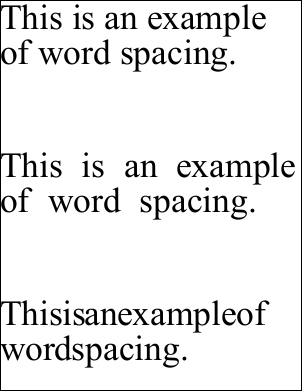

# WordSpacing Property

| Type | Default | Read Only | Description | 
| --- | --- | --- | --- |
| **[C#]** ```csharp double ``` [Visual Basic]`Double` | 0.0 | No | The inter-word spacing. | 

## Notes

This property controls the spacing between each word.

This property works in a similar way to the [CharSpacing](charspacing.md) property but the value is added to only space characters in the string. This has the effect of spacing out words or pushing them together depending on the sign of the value, and the property bears the same relation to the font's writing mode as [CharSpacing](charspacing.md).

Because this property is an absolute value the visual effect will be greater if your text is smaller.

## Example

In this example we add three blocks of text to a document. The first block uses the default spacing. The second block uses a positive value to stretch out the text. The last block uses a negative value to condense the text.

[C#]

```csharp
using var doc = new Doc();
string text = "This is an example of word spacing.";
doc.TextStyle.Size = 72;
doc.AddText(text);
doc.Rect.Move(0, -300);
doc.TextStyle.WordSpacing = 20;
doc.AddText(text);
doc.Rect.Move(0, -300);
doc.TextStyle.WordSpacing = -20;
doc.AddText(text);
doc.Save(Server.MapPath("stylewspace.pdf"));
```

<span class=language>[Visual Basic]</span>
```vbnet
Using doc As New Doc()
  Dim theText As String = "This is an example of word spacing."
  doc.TextStyle.Size = 72
  doc.AddText(theText)
  doc.Rect.Move(0, -300)
  doc.TextStyle.WordSpacing = 20
  doc.AddText(theText)
  doc.Rect.Move(0, -300)
  doc.TextStyle.WordSpacing = -20
  doc.AddText(theText)
  doc.Save(Server.MapPath("stylewspace.pdf"))
End Using
```

stylewspace.pdf