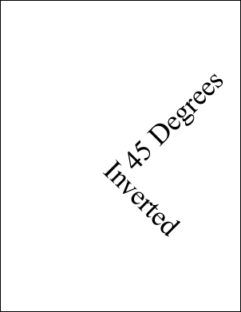

# Invert Function

Invert the transform.

## Syntax

**[C#]**

```csharp
void Invert()
```

<span class=language>[Visual
            Basic]</span>  
`Sub Invert()`
## Params

| Name | Description | 
| --- | --- |
| None |  | 

## Notes

When you invert a transform a rotation clockwise becomes an identical rotation anti-clockwise. A translation to the left becomes a translation to the right. A zoom in becomes a zoom out.

Note that not every transform can be inverted. If you specify a magnification of zero you have shrunk your world space to a point. In this case it is not possible to invert the transform to get the original back again. However this kind of transform is uncommon in the real world and normally only occurs as a result of programming errors.

If you apply the invert method to a non-invertable transform the transform will remain unmodified.

## Example

Here we add some text rotated at 45 degrees anti-clockwise around the middle of the document. We then invert the transform and draw some more text. Because the transform has been inverted the text now appears rotated 45 degrees clockwise.

[C#]

```csharp
using var doc = new Doc();
doc.FontSize = 72;
doc.Rect.String = "0 0 999 999";
doc.Pos.String = "302 396";
doc.Transform.Rotate(45, 302, 396);
doc.AddText("45 Degrees");
doc.Pos.String = "302 396";
doc.Transform.Invert();
doc.AddText("Inverted");
doc.Save(Server.MapPath("transforminvert.pdf"));
```

<span class=language>[Visual Basic]</span>
```vbnet
Using doc As New Doc()
  doc.FontSize = 72
  doc.Rect.String = "0 0 999 999"
  doc.Pos.String = "302 396"
  doc.Transform.Rotate(45, 302, 396)
  doc.AddText("45 Degrees")
  doc.Pos.String = "302 396"
  doc.Transform.Invert()
  doc.AddText("Inverted")
  doc.Save(Server.MapPath("transforminvert.pdf"))
End Using
```

transforminvert.pdf