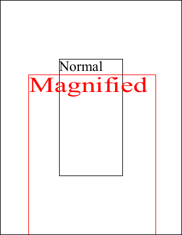

# Magnify Function

Scale about a locked anchor point.

## Syntax

[C#]

```csharp
void Magnify(double scaleX, double scaleY, double anchorX, double anchorY)
```

## Params

| **Name** | **Description** |
| --- | --- |
| scaleX | The amount of horizontal scaling to apply. |
| scaleY | The amount of vertical scaling to apply. |
| anchorX | The horizontal coordinate about which the stretch should be applied. |
| anchorY | The vertical coordinate about which the stretch should be applied. |

## Notes

This method stretches the world space about a locked anchor point. Different degrees of horizontal and vertical stretch can be used.

Another way of looking at this kind of transform is as a zoom. The anchor point is the location you're zooming in on and the scale factors indicate the level of zoom.

## Example

Here we add two chunks of text. The default text is added in black and the magnified text is drawn in red. We specify the middle of the document as the anchor point which means that all scaling is relative to the middle of the document. Our horizontal scale factor is larger than our text has been stretched horizontally somewhat.

[C#]

```csharp
using var doc = new Doc();
doc.Rect.Inset(200, 200);
doc.FontSize = 48;
doc.AddText("Normal");
doc.FrameRect();
doc.Rect.Move(0, -100);
doc.Color.String = "255 0 0";
doc.Transform.Magnify(2, 1.5, 302, 396);
doc.AddText("Magnified");
doc.FrameRect();
doc.Save("transformmagnify.pdf");
```


transformmagnify.pdf

Also see example code in:

* [Page GetBitmap Function](6-abcpdf.objects/page/1-methods/getbitmap.md)
* [Page MakeFormXObject Function](6-abcpdf.objects/page/1-methods/makeformxobject.md).
