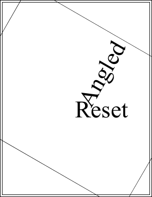

# Reset Function

Reset to the identity.

## Syntax

[C#]

```csharp
void Reset()
```

[Visual Basic]

```vb
Sub Reset()
```

## Params

| **Name** | **Description** |
| --- | --- |
| None |  |

## Notes

This method resets the transform to it's original state. This state is known as the identity and indicates that no transformation will be applied.

## Example

Here we add some text rotated at 60 degrees around the middle of the document. We then reset the transform and draw some more text. This text is drawn with no rotation because the transform has been reset.

[C#]

```csharp
using var doc = new Doc();
doc.Rect.Inset(10, 10);
doc.FontSize = 96;
doc.Transform.Rotate(60, 302, 396);
doc.Pos.String = "302 396";
doc.AddText("Angled");
doc.FrameRect();
doc.Transform.Reset();
doc.Pos.String = "302 396";
doc.AddText("Reset");
doc.FrameRect();
doc.Save(Server.MapPath("transformreset.pdf"));
```

[Visual Basic]

```vb
Using doc As New Doc()
  doc.Rect.Inset(10, 10)
  doc.FontSize = 96
  doc.Transform.Rotate(60, 302, 396)
  doc.Pos.String = "302 396"
  doc.AddText("Angled")
  doc.FrameRect()
  doc.Transform.Reset()
  doc.Pos.String = "302 396"
  doc.AddText("Reset")
  doc.FrameRect()
  doc.Save(Server.MapPath("transformreset.pdf"))
End Using
```


transformreset.pdf

Also see example code in:

* [XTransform Rotate Function](rotate.md)
* [FontObject Widths Property](6-abcpdf.objects/fontobject/2-properties/widths.md)
* [Page GetBitmap Function](6-abcpdf.objects/page/1-methods/getbitmap.md).
