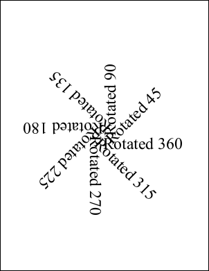

# Rotate Function

Rotate about a locked anchor point (angle in degrees).

## Syntax

[C#]

```csharp
void Rotate(double angle, double anchorX, double anchorY)
```

## Params

| **Name** | **Description** |
| --- | --- |
| angle | The angle to rotate in degrees. |
| anchorX | The horizontal coordinate about which the rotation should be applied. |
| anchorY | The vertical coordinate about which the rotation should be applied. |

## Notes

This method rotates the world space about a locked anchor point. The angle is specified in degrees anti-clockwise.

## Example

Here we add a number of chunks of text rotated at different angles about the middle of the document.

[C#]

```csharp
using var doc = new Doc();
doc.FontSize = 48;
doc.TextStyle.Indent = 48;
for (int i = 1; i <= 8; i++) {
  int angle = i * 45;
  doc.Pos.String = "302 396";
  doc.Transform.Reset();
  doc.Transform.Rotate(angle, 302, 396);
  doc.AddText($"Rotated {angle}");
}
doc.Save("rotate.pdf");
```


rotate.pdf

Also see example code in:

* [ABCpdf Landscape Example](4-examples/08-landscape.md)
* [Doc AddGrid Function](doc/1-methods/addgrid.md)
* [Doc AddXObject Function](doc/1-methods/addxobject.md)
* [Doc Transform Property](doc/2-properties/transform.md)
* [XTransform Invert Function](invert.md)
* [XTransform Reset Function](reset.md)
* [XTransform AngleUnit Property](2-properties/angleunit.md)
* [FontObject Widths Property](6-abcpdf.objects/fontobject/2-properties/widths.md)
* [Page Rotation Property](6-abcpdf.objects/page/2-properties/rotation.md)
* [XpsImportOperation Import Function](8-abcpdf.operations/4-xpsimportoperation/1-methods/import.md).
