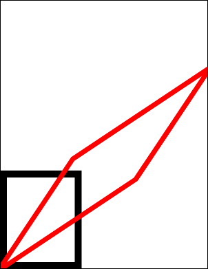

# Skew Function

Skew horizontally and vertically about a locked anchor point.

## Syntax

[C#]

```csharp
void Skew(double skewX, double skewY, double anchorX, double anchorY)
```

[Visual Basic]

```vb
Sub Skew(skewX As Double, skewY As Double, anchorX As Double, anchorY As Double)
```

## Params

| **Name** | **Description** |
| --- | --- |
| skewX | The amount of horizontal skewing to apply. |
| skewY | The amount of vertical skewing to apply. |
| anchorX | The horizontal coordinate about which the stretch should be applied. |
| anchorY | The vertical coordinate about which the stretch should be applied. |

## Notes

This method skews the world space about a locked anchor point. Different degrees of horizontal and vertical stretch can be used.

A skew or shear is a mathematical operation which shifts points by an amount proportional to the distance from the anchor point. This shift is scaled by the horizontal and vertical skew factors.

## Example

Here we draw two rectangles into our document. The black rectangle is drawn before the skew operation and the red one is drawn after it.

[C#]

```csharp
using var doc = new Doc();
doc.Rect.Width = 200;
doc.Rect.Height = 250;
doc.Rect.Position(20, 20);
doc.Width = 20;
doc.FrameRect();
doc.Transform.Skew(1.5, 1.5, 20, 20);
doc.Color.String = "255 0 0"; // red
doc.FrameRect();
doc.Save(Server.MapPath("transformskew.pdf"));
```

[Visual Basic]

```vb
Using doc As New Doc()
  doc.Rect.Width = 200
  doc.Rect.Height = 250
  doc.Rect.Position(20, 20)
  doc.Width = 20
  doc.FrameRect()
  doc.Transform.Skew(1.5, 1.5, 20, 20)
  doc.Color.String = "255 0 0"
  ' red
  doc.FrameRect()
  doc.Save(Server.MapPath("transformskew.pdf"))
End Using
```


transformskew.pdf

