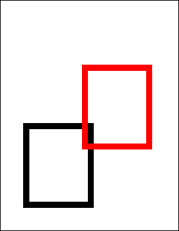

# Translate Function

Translate horizontally and vertically.

## Syntax

**[C#]**

```csharp
void Translate(double x, double y)
```

<span class=language>[Visual Basic]</span>  
`Sub Translate(x As Double, y As Double)`
## Params

| Name | Description | 
| --- | --- |
| x | The distance to translate to the right. | 
| y | The distance to translate upwards. | 

## Notes

This method shifts the world space a specified distance up and to the right. Objects on the PDF will appear to translate upwards and to the right.

## Example

Here we draw two rectangles into our document. The black rectangle is drawn before the translation operation and the red one is drawn after it.

[C#]

```csharp
using var doc = new Doc();
doc.Rect.Width = 200;
doc.Rect.Height = 250;
doc.Rect.Position(100, 100);
doc.Width = 20;
doc.FrameRect();
doc.Transform.Translate(200, 200);
doc.Color.String = "255 0 0"; // red
doc.FrameRect();
doc.Save(Server.MapPath("transformtranslate.pdf"));
```

<span class=language>[Visual Basic]</span>
```vbnet
Using doc As New Doc()
  doc.Rect.Width = 200
  doc.Rect.Height = 250
  doc.Rect.Position(100, 100)
  doc.Width = 20
  doc.FrameRect()
  doc.Transform.Translate(200, 200)
  doc.Color.String = "255 0 0"
  ' red
  doc.FrameRect()
  doc.Save(Server.MapPath("transformtranslate.pdf"))
End Using
```

transformtranslate.pdf

Also see example code in: [ABCpdf Landscape Example](../../../4-examples/08-landscape.md), [Page GetBitmap Function](../../../6-abcpdf.objects/page/1-methods/getbitmap.md), [Page Rotation Property](../../../6-abcpdf.objects/page/2-properties/rotation.md), [XpsImportOperation Import Function](../../../8-abcpdf.operations/4-xpsimportoperation/1-methods/import.md).