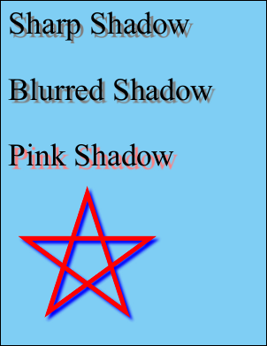

# GetBitmap Function

Render one or more layers on the current page

## Syntax

**[C#]**

```csharp
System.Drawing.Bitmap GetBitmap(Layer[] layers)
```

<span class=language>[Visual
            Basic]</span>  

            `Function GetBitmap(layers() As Layer) As System.Drawing.Bitmap``may throw Exception()`

## Params

| Name | Description | 
| --- | --- |
| layers | The layers to be rendered. | 
| return | The System.Drawing.Bitmap containing the image of the layers. | 

## Notes

Render one or more layers on the current page.

This function renders a set of layers and returns the result as a System.Drawing.Bitmap. The Bitmap covers the smallest possible area which encompasses all the layers provided.

If this Page is not in a Doc then an exception will be raised. The function will return null if the layers argument is null or empty or the output Bitmap would be smaller than one pixel in area.

Rendering options such as resolution are taken directly from the current [Doc.Rendering](../../../5-abcpdf/doc/2-properties/rendering.md) settings. However automatic page rotation (XRendering.AutoRotate) is disabled so that a Layer can be rendered and then re-inserted into the page as a raster copy of itself.

Note that a layer can exist on multiple pages and indeed can be rendered in the context of a page that does not currently contain it. However layers typically contain references to named resources which are only available in the context of a specific page. So rendering a layer in the context of a page which does not normally contain it is prone to error unless the page and layer have been specifically constructed to allow this.

## Example

The following example shows how to use this method to generate various types of drop shadows.

[C#]

```csharp
using var doc = new Doc();
// light blue background
doc.Color.SetCmyk(50, 0, 0, 0);
doc.FillRect();
doc.Color.SetRgb(0, 0, 0);
doc.Rect.Inset(20, 20);
doc.Rect.Pin = XRect.Corner.TopLeft;
doc.Rect.Height = doc.Rect.Height / 5;
// set up styles
doc.TextStyle.Size = 72;
double shift = doc.TextStyle.Size * 0.1;
var pink = new XColor();
pink.SetRgb(255, 128, 128);
var gray = new XColor();
gray.SetRgb(128, 128, 128);
var blue = new XColor();
blue.SetRgb(0, 0, 255);
// add text content
AddDropShadow(doc, doc.AddText("Sharp Shadow"), 0, shift, -shift, gray);
doc.Rect.Move(0, -doc.Rect.Height);
AddDropShadow(doc, doc.AddText("Blurred Shadow"), 1, shift, -shift, gray);
doc.Rect.Move(0, -doc.Rect.Height);
AddDropShadow(doc, doc.AddText("Pink Shadow"), 1, shift, -shift, pink);
doc.Rect.Move(0, -doc.Rect.Height);
// add drawn content
doc.Transform.Magnify(0.5, 0.5, 0, 0);
doc.Transform.Translate(50, 0);
string star = "124 158 300 700 476 158 15 493 585 493 124 158";
doc.Width = 20;
doc.Color.String = "255 0 0";
AddDropShadow(doc, doc.AddPoly(star, false), 3, shift, -shift, blue);
doc.Save(Server.MapPath("dropshadows.pdf"));
```

<span class=language>[Visual Basic]</span>
```vbnet
Using doc As New Doc()
  ' light blue background
  doc.Color.SetCmyk(50, 0, 0, 0)
  doc.FillRect()
  doc.Color.SetRgb(0, 0, 0)
  doc.Rect.Inset(20, 20)
  doc.Rect.Pin = XRect.Corner.TopLeft
  doc.Rect.Height = doc.Rect.Height / 5
  ' set up styles
  doc.TextStyle.Size = 72
  Dim shift As Double = doc.TextStyle.Size * 0.1
  Dim pink As New XColor()
  pink.SetRgb(255, 128, 128)
  Dim gray As New XColor()
  gray.SetRgb(128, 128, 128)
  Dim blue As New XColor()
  blue.SetRgb(0, 0, 255)
  ' add text content
  AddDropShadow(doc, doc.AddText("Sharp Shadow"), 0, shift, -shift, gray)
  doc.Rect.Move(0, -doc.Rect.Height)
  AddDropShadow(doc, doc.AddText("Blurred Shadow"), 1, shift, -shift, gray)
  doc.Rect.Move(0, -doc.Rect.Height)
  AddDropShadow(doc, doc.AddText("Pink Shadow"), 1, shift, -shift, pink)
  doc.Rect.Move(0, -doc.Rect.Height)
  ' add drawn content
  doc.Transform.Magnify(0.5, 0.5, 0, 0)
  doc.Transform.Translate(50, 0)
  Dim star As String = "124 158 300 700 476 158 15 493 585 493 124 158"
  doc.Width = 20
  doc.Color.String = "255 0 0"
  AddDropShadow(doc, doc.AddPoly(star, False), 3, shift, -shift, blue)
  doc.Save(Server.MapPath("dropshadows.pdf"))
End Using
```

The code above utilises the following AddDropShadow method.

[C#]

```csharp
void AddDropShadow(Doc doc, int id, double gaussianBlurRadius, double shadowHorizontalShift, double shadowVerticalShift, XColor shadowColor) {
  string rect = doc.Rect.String;
  string transform = doc.Transform.String;
  string color = doc.Color.String;
  double dpiX = doc.Rendering.DotsPerInchX;
  double dpiY = doc.Rendering.DotsPerInchY;
  bool saveAlpha = doc.Rendering.SaveAlpha;
  int docLayer = doc.Layer;
  try {
    doc.Rendering.DotsPerInch = 72;
    doc.Rendering.SaveAlpha = true;
    var layer = doc.ObjectSoup[id] as Layer;
    var page = doc.ObjectSoup[doc.Page] as Page;
    var bm = page.GetBitmap(new Layer[] { layer });
    // expand image if blur may move content off edges
    int border = 0;
    if (gaussianBlurRadius > 0) {
      // we extend our border out two standard deviations
      border = (int)Math.Round(Math.Abs(gaussianBlurRadius)) * 2;
      int borders = border * 2;
      var larger = new Bitmap(bm.Width + borders, bm.Height + borders, bm.PixelFormat);
      larger.SetResolution(bm.HorizontalResolution, bm.VerticalResolution);
      using (var graphics = Graphics.FromImage(larger)) {
        graphics.DrawImage(bm, new Point(border, border));
        if (bm != null)
          bm.Dispose();
        bm = larger;
      }
    }
    doc.Transform.Reset();
    doc.Rect.String = layer.Rect.String;
    doc.Rect.Inset(-border, -border);
    doc.Rect.Move(shadowHorizontalShift, shadowVerticalShift);
    doc.Layer = docLayer + 1;
    int pid = doc.AddImageBitmap(bm, true);
    bm.Dispose();
    // Here we set the base image to be one pixel of an appropriate color.
    // This is what will determine the shadow color.
    var img = doc.ObjectSoup[pid] as ImageLayer;
    var pm = img.PixMap;
    pm.ClearData(); // this will remove any compression settings
    pm.SetData(new byte[] { (byte)shadowColor.Red, (byte)shadowColor.Green, (byte)shadowColor.Blue });
    pm.Width = 1;
    pm.Height = 1;
    // The alpha channel is held as a separate soft mask and this is what will
    // determine the shape of the shadow. If required we blur it to give it
    // soft edges.
    var alpha = pm.SMask;
    if (gaussianBlurRadius > 0) {
      using (EffectOperation effect = new EffectOperation("Gaussian Blur")) {
        effect.Parameters["Radius"].Value = gaussianBlurRadius;
        effect.Apply(alpha);
      }
    }
  }
  finally {
    doc.Rect.String = rect;
    doc.Transform.String = transform;
    doc.Color.String = color;
    doc.Rendering.DotsPerInchX = dpiX;
    doc.Rendering.DotsPerInchY = dpiY;
    doc.Rendering.SaveAlpha = saveAlpha;
    doc.Layer = docLayer;
  }
}
```

<span class=language>[Visual Basic]</span>
```vbnet
Private Sub AddDropShadow(doc As Doc, id As Integer, gaussianBlurRadius As Double, shadowHorizontalShift As Double, shadowVerticalShift As Double, shadowColor As XColor)
  Dim rect As String = doc.Rect.String
  Dim transform As String = doc.Transform.String
  Dim color As String = doc.Color.String
  Dim dpiX As Double = doc.Rendering.DotsPerInchX
  Dim dpiY As Double = doc.Rendering.DotsPerInchY
  Dim saveAlpha As Boolean = doc.Rendering.SaveAlpha
  Dim docLayer As Integer = doc.Layer
  Try
    doc.Rendering.DotsPerInch = 72
    doc.Rendering.SaveAlpha = True
    Dim layer As Layer = TryCast(doc.ObjectSoup(id), Layer)
    Dim page As Page = TryCast(doc.ObjectSoup(doc.Page), Page)
    Dim bm As Bitmap = page.GetBitmap(New Layer() {layer})
    ' expand image if blur may move content off edges
    Dim border As Integer = 0
    If gaussianBlurRadius > 0 Then
      ' we extend our border out two standard deviations
      border = DirectCast(Math.Round(Math.Abs(gaussianBlurRadius)), Integer) * 2
      Dim borders As Integer = border * 2
      Dim larger As New Bitmap(bm.Width + borders, bm.Height + borders, bm.PixelFormat)
      larger.SetResolution(bm.HorizontalResolution, bm.VerticalResolution)
      Using graphics__1 As Graphics = Graphics.FromImage(larger)
        graphics__1.DrawImage(bm, New Point(border, border))
        bm = larger
      End Using
    End If
    doc.Transform.Reset()
    doc.Rect.String = layer.Rect.[String]
    doc.Rect.Inset(-border, -border)
    doc.Rect.Move(shadowHorizontalShift, shadowVerticalShift)
    doc.Layer = docLayer + 1
    Dim pid As Integer = doc.AddImageBitmap(bm, True)
    ' Here we set the base image to be one pixel of an appropriate color.
    ' This is what will determine the shadow color.
    Dim img As ImageLayer = TryCast(doc.ObjectSoup(pid), ImageLayer)
    Dim pm As PixMap = img.PixMap
    pm.ClearData()
    ' this will remove any compression settings
    pm.SetData(New Byte() {DirectCast(shadowColor.Red, Byte), DirectCast(shadowColor.Green, Byte), DirectCast(shadowColor.Blue, Byte)})
    pm.Width = 1
    pm.Height = 1
    ' The alpha channel is held as a separate soft mask and this is what will
    ' determine the shape of the shadow. If required we blur it to give it
    ' soft edges.
    Dim alpha As PixMap = pm.SMask
    If gaussianBlurRadius > 0 Then
      Using effect As New EffectOperation("Gaussian Blur")
        effect.Parameters("Radius").Value = gaussianBlurRadius
        effect.Apply(alpha)
      End Using
    End If
  Finally
    doc.Rect.String = rect
    doc.Transform.String = transform
    doc.Color.String = color
    doc.Rendering.DotsPerInchX = dpiX
    doc.Rendering.DotsPerInchY = dpiY
    doc.Rendering.SaveAlpha = saveAlpha
    doc.Layer = docLayer
  End Try
End Sub
```

 dropshadows.pdf