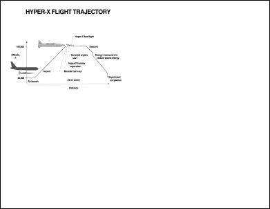

# MakeFormXObject Function

Makes a FormXObject out of the page.

## Syntax

**[C#]**

```csharp
FormXObject MakeFormXObject()
```

<span class=language>[Visual
            Basic]</span>  

            `Function MakeFormXObject() As FormXObject`
## Params

| Name | Description | 
| --- | --- |
| return | The newly created FormXObject. | 

## Notes

Makes a [FormXObject](../../formxobject/2-properties/matrix.md) out of the page.

This process involves copying the page content stream to a new Form XObject and referencing any required resources. The current page is left unaltered.

The returned FormXObject will have been added to the same ObjectSoup as contains the Page. The returned Form XObject can then be added to other pages using methods such as [AddXObject](../../../5-abcpdf/doc/1-methods/addxobject.md).

## Example

This example shows how to take a page, convert it into a separate drawing object and then draw it, scaled, onto the page it came from.

[C#]

```csharp
using var doc = new Doc();
doc.Read(Server.MapPath("../mypics/HyperX.pdf"));
var page1 = doc.ObjectSoup[doc.Page] as Page;
var form = page1.MakeFormXObject();
doc.Transform.Magnify(0.5, 0.5, 0, 0);
doc.Page = doc.AddPage();
var page2 = doc.ObjectSoup[doc.Page] as Page;
string name = page2.AddResource(form, "XObject", "Iabc");
// Here we create our own layer for the purposes of the demonstration.
// However a simpler approach would be to use Doc.AddXObject.
var layer = new StreamObject(doc.ObjectSoup);
layer.SetText(String.Format("q {0} cm /{1} Do Q ", doc.Transform.ToString(), name));
page2.AddLayer(layer);
doc.Save(Server.MapPath("exampleformxobject.pdf"));
```

<span class=language>[Visual Basic]</span>
```vbnet
Using doc As New Doc()
  doc.Read(Server.MapPath("../mypics/HyperX.pdf"))
  Dim page1 As Page = TryCast(doc.ObjectSoup(doc.Page), Page)
  Dim form As FormXObject = page1.MakeFormXObject()
  doc.Transform.Magnify(0.5, 0.5, 0, 0)
  doc.Page = doc.AddPage()
  Dim page2 As Page = TryCast(doc.ObjectSoup(doc.Page), Page)
  Dim name As String = page2.AddResource(form, "XObject", "Iabc")
  ' Here we create our own layer for the purposes of the demonstration.
  ' However a simpler approach would be to use Doc.AddXObject.
  Dim layer As New StreamObject(doc.ObjectSoup)
  layer.SetText([String].Format("q {0} cm /{1} Do Q ", doc.Transform.ToString(), name))
  page2.AddLayer(layer)
  doc.Save(Server.MapPath("exampleformxobject.pdf"))
End Using
```

 exampleformxobject.pdf [Page 1]

 exampleformxobject.pdf [Page 2]