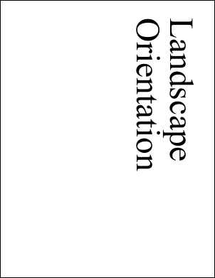

# Rotation Property

| Type | Default | Read Only | Description | 
| --- | --- | --- | --- |
| **[C#]** ```csharp int ``` [Visual Basic] `Integer` | n/a | No | The number of degrees to rotate the page before display. | 

## Notes

The number of degrees clockwise to rotate the page before display.

The values 0 and 180 indicate portrait orientation. The values 90 and 270 indicate landscape orientation.

This value should be a multiple of 90.

## Example

This example shows how to use the Rotation property to determine how to add a PDF page - which may be rotated - to a portrait PDF page.

[C#]

```csharp
using var doc = new Doc();
using var src = new Doc();
src.Read(Server.MapPath("landscape.pdf"));
int rotation = ((Page)src.ObjectSoup[src.Page]).Rotation;
bool landscape = src.MediaBox.Width > src.MediaBox.Height;
doc.Page = doc.AddPage();   // output is always in portrait
if (landscape) {
  switch (rotation) {

    case 0:
    case 90:
      doc.Transform.Rotate(270, 0, 0);
      doc.Transform.Translate(0, doc.MediaBox.Height);
      break;
    case 180:
    case 270:
      doc.Transform.Rotate(90, 0, 0);
      doc.Transform.Translate(doc.MediaBox.Width, 0);
      break;
  }
  doc.Rect.SetRect(0, 0, doc.MediaBox.Height, doc.MediaBox.Width);
}
else {
  switch (rotation) {
    case 90:
    case 180:
      doc.Transform.Rotate(180, 0, 0);
      doc.Transform.Translate(doc.MediaBox.Width, doc.MediaBox.Height);
      break;
  }
}
doc.AddImageDoc(src, 1, null);
doc.Save(Server.MapPath("addtoportrait.pdf"));
```

<span class=language>[Visual Basic]</span>
```vbnet
Using doc As New Doc(), src As New Doc()
  src.Read(Server.MapPath("landscape.pdf"))
  Dim rotation As Integer = DirectCast(src.ObjectSoup(src.Page), Page).Rotation
  Dim landscape As Boolean = src.MediaBox.Width > src.MediaBox.Height
  doc.Page = doc.AddPage()
  ' output is always in portrait
  If landscape Then
    Select Case rotation

      Case 0, 90
        doc.Transform.Rotate(270, 0, 0)
        doc.Transform.Translate(0, doc.MediaBox.Height)
        Exit Select
      Case 180, 270
        doc.Transform.Rotate(90, 0, 0)
        doc.Transform.Translate(doc.MediaBox.Width, 0)
        Exit Select
    End Select
    doc.Rect.SetRect(0, 0, doc.MediaBox.Height, doc.MediaBox.Width)
  Else
    Select Case rotation
      Case 90, 180
        doc.Transform.Rotate(180, 0, 0)
        doc.Transform.Translate(doc.MediaBox.Width, doc.MediaBox.Height)
        Exit Select
    End Select
  End If
  doc.AddImageDoc(src, 1, Nothing)
  doc.Save(Server.MapPath("addtoportrait.pdf"))
End Using
```

 landscape.pdf

 addtoportrait.pdf