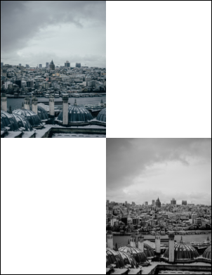

# ToGrayscale Function

Converts the image to grayscale.

## Syntax

**[C#]**

```csharp
void ToGrayscale()
```

**[Visual Basic]**

`Sub ToGrayscale()`
## Params

| Name | Description | 
| --- | --- |
| none |  | 

## Notes

This allows you to convert an image to grayscale. It can be useful for preparing soft masks.

This function is a convenience method for this common operation. A practically identical effect can be achieved using the [Recolor](recolor.md) method followed by [Compress](../../streamobject/1-methods/compress.md).

## Example

Here we add an image in its natural color space and then, at a position down and to the right, converted to grayscale.

[C#]

```csharp
using var doc = new Doc();
doc.Rect.Pin = XRect.Corner.TopLeft;
doc.Rect.Magnify(0.5, 0.5);
string path = Server.MapPath("../mypics/mypic.jpg");
doc.AddImageFile(path, 1);
doc.Rect.Move(doc.Rect.Width, -doc.Rect.Height);
int i = doc.AddImageFile(path, 1);
var im = (ImageLayer)doc.ObjectSoup[i];
im.PixMap.ToGrayscale();
doc.Save(Server.MapPath("pixmaptograyscale.pdf"));
```

**[Visual Basic]**

```vbnet
Using doc As New Doc()
  doc.Rect.Pin = XRect.Corner.TopLeft
  doc.Rect.Magnify(0.5, 0.5)
  Dim thePath As String = Server.MapPath("../mypics/mypic.jpg")
  doc.AddImageFile(thePath, 1)
  doc.Rect.Move(doc.Rect.Width, -doc.Rect.Height)
  Dim i As Integer = doc.AddImageFile(thePath, 1)
  Dim im As ImageLayer = DirectCast(doc.ObjectSoup(i), ImageLayer)
  im.PixMap.ToGrayscale()
  doc.Save(Server.MapPath("pixmaptograyscale.pdf"))
End Using
```

 pixmaptograyscale.pdf