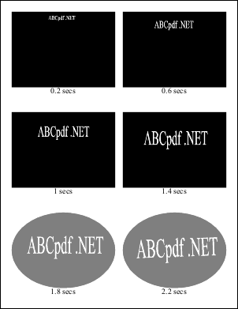
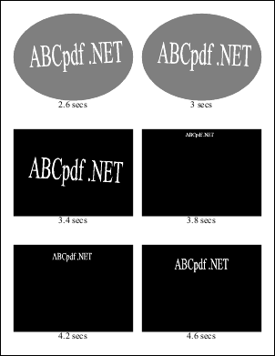

# Import Function

Imports selected frames of a Flash movie.

## Syntax

**[C#]**

```csharp
void Import(string path)
void Import(Stream stream, string url)
```

<span class=language>[Visual Basic]</span>  

```
Sub Import(path As String)
Sub Import(stream As Stream, url As String)
```
`may throw Exception()`

## Params

| Name | Description | 
| --- | --- |
| path | The file path to the Flash movie. | 
| stream | The stream containing the Flash movie. | 
| url | The value of the MovieClip._url ActionScript property. | 

## Notes

Imports selected frames of a Flash movie. By default, only one frame is imported. ActionScript 2 or below is supported. ActionScript 3 is not supported.

Alpha Blending. PDF supports using different color spaces for alpha blending. When there is a transparent object on a page, the blending color space will be used. By default, it uses DeviceCMYK. You will likely see some color shifts even for opaque objects because colors are converted to the alpha blending color space and then to DeviceRGB for display. The effect is more noticeable for objects using component-wise alpha blending.

To use RGB as it is used in SWF for alpha blending, set the default blending color space for the page to DeviceRGB:

[C#]

```csharp
doc.SetInfo(doc.Page, "/Group*/Type:Name", "Group");
doc.SetInfo(doc.Page, "/Group*/S:Name", "Transparency");
doc.SetInfo(doc.Page, "/Group*/CS:Name", "DeviceRGB");
```

**[Visual Basic]**

```vbnet
doc.SetInfo(doc.Page, "/Group*/Type:Name", "Group");
doc.SetInfo(doc.Page, "/Group*/S:Name", "Transparency");
doc.SetInfo(doc.Page, "/Group*/CS:Name", "DeviceRGB");
```

You must specify a [Doc](../2-properties/1-doc.md) before the [ProcessingObject](../../1-operation/3-events/1-processingobject.md) event of ProcessingSourceType.ImageFrame returns/is handled.

An exception will be thrown if the operation is not possible. This may happen if the Flash movie is corrupt.

1. Before the Flash engine advances, a [ProcessingObject](../../1-operation/3-events/1-processingobject.md) event of ProcessingSourceType.MultiFrameImage is generated. If [ResetRegions](../2-properties/4-resetregions.md) is true, [BackgroundRegion](../2-properties/2-backgroundregion.md) and [ClipRegion](../2-properties/3-clipregion.md) are reset to the frame bounds/stage size of the Flash movie when the event is generated. The regions are set as if [XRect.SetRect](../../../5-abcpdf/xrect/1-methods/setrect.md) is called with the [X](../../2-processinginfo/2-properties/3-x.md), [Y](../../2-processinginfo/2-properties/4-y.md), [Width](../../2-processinginfo/2-properties/5-width.md), and [Height](../../2-processinginfo/2-properties/6-height.md) properties of the [ProcessingInfo](../../2-processingobjecteventargs/2-properties/info.md). You can provide parameters in [Parameters](../2-properties/parameters.md) for initializing the SWF machine before the first time a proper [FrameNumber](../../2-processinginfo/2-properties/framenumber.md) is returned in this event. | Name | Description | | --- | --- | | ProcessingObjectEventArgs.Cancel | See ProcessingObjectEventArgs.Info.FrameNumber below. | | ProcessingObjectEventArgs.Info.Handled | Ignored. | | ProcessingObjectEventArgs.Info.SourceType | ProcessingSourceType.MultiFrameImage | | ProcessingObjectEventArgs.Info.FrameCount | The number of frames in the Flash movie. | | ProcessingObjectEventArgs.Info.FrameNumber | The positive number of frames from the start of the movie to elapse before rendering. This value is not bounded by FrameCount. The value of this property for the first of such events is one. Subsequent value is null. The event handler may set this value to a number equal to or greater than the value set in a previous such event. If the value is set smaller, the corresponding ProcessedObject event indicating failure is generated. Set it to null to end the processing of the entire movie. If it is null, the corresponding ProcessedObject event is not generated. Otherwise, if ProcessingObjectEventArgs.Cancel is set to true, the corresponding ProcessedObject event is not generated, and the same event is immediately generated again with this value set to null. | | ProcessingObjectEventArgs.Info.FrameRate | The number of frames per second of the Flash movie. | | ProcessingObjectEventArgs.Info.X | The x-coordinate (in twips) of the frame bounds of the Flash movie. | | ProcessingObjectEventArgs.Info.Y | The y-coordinate (in twips) of the frame bounds of the Flash movie. | | ProcessingObjectEventArgs.Info.Width | The width (in twips) of the stage of the Flash movie. | | ProcessingObjectEventArgs.Info.Height | The height (in twips) of the stage of the Flash movie. |
2. After a proper [FrameNumber](../../2-processinginfo/2-properties/framenumber.md) is returned in a previous [ProcessingObject](../../1-operation/3-events/1-processingobject.md) event of ProcessingSourceType.MultiFrameImage and the Flash engine advances to the frame, a [ProcessingObject](../../1-operation/3-events/1-processingobject.md) event of ProcessingSourceType.ImageFrame is generated. If [ResetRegions](../2-properties/4-resetregions.md) is true, [BackgroundRegion](../2-properties/2-backgroundregion.md) and [ClipRegion](../2-properties/3-clipregion.md) are reset to the frame bounds/stage size of the Flash movie when the event is generated because the frame actions may have changed the stage scale mode. You must specify a [Doc](../2-properties/1-doc.md) before this event returns/is handled. The frame is rendered on to [Doc.Rect](../../../5-abcpdf/doc/2-properties/rect.md) of the current page using [Doc.Transform](../../../5-abcpdf/doc/2-properties/transform.md). | Name | Description | | --- | --- | | ProcessingObjectEventArgs.Cancel | If this property is set to true, the frame is not rendered and the corresponding ProcessedObject event is not generated. | | ProcessingObjectEventArgs.Info.Handled | Ignored. | | ProcessingObjectEventArgs.Info.SourceType | ProcessingSourceType.ImageFrame | | ProcessingObjectEventArgs.Info.FrameCount | The number of frames in the Flash movie. | | ProcessingObjectEventArgs.Info.FrameNumber | The number of frames elapsed from the start of the movie. | | ProcessingObjectEventArgs.Info.FrameRate | The number of frames per second of the Flash movie. | | ProcessingObjectEventArgs.Info.X | The x-coordinate (in twips) of the frame bounds of the Flash movie. | | ProcessingObjectEventArgs.Info.Y | The y-coordinate (in twips) of the frame bounds of the Flash movie. | | ProcessingObjectEventArgs.Info.Width | The width (in twips) of the stage of the Flash movie. | | ProcessingObjectEventArgs.Info.Height | The height (in twips) of the stage of the Flash movie. | | ProcessingObjectEventArgs.Info.BackgroundColor | The background color of the frame. |
3. While rendering a frame, a [ProcessingObject](../../1-operation/3-events/1-processingobject.md) event of ProcessingSourceType.Image is generated when an image is imported. | Name | Description | | --- | --- | | ProcessingObjectEventArgs.Cancel | Ignored. | | ProcessingObjectEventArgs.Info.Handled | Ignored. | | ProcessingObjectEventArgs.Info.SourceType | ProcessingSourceType.Image | | ProcessingObjectEventArgs.Info.FrameCount | The number of frames in the Flash movie. | | ProcessingObjectEventArgs.Info.FrameNumber | The number of frames elapsed from the start of the movie. | | ProcessingObjectEventArgs.Info.FrameRate | The number of frames per second of the Flash movie. | | ProcessingObjectEventArgs.Info.Width | The pixel width of the image. | | ProcessingObjectEventArgs.Info.Height | The pixel height of the image. |
4. While rendering a frame, a [ProcessingObject](../../1-operation/3-events/1-processingobject.md) event of ProcessingSourceType.ImageMask is generated when an image used as a mask is imported. | Name | Description | | --- | --- | | ProcessingObjectEventArgs.Cancel | Ignored. | | ProcessingObjectEventArgs.Info.Handled | Ignored. | | ProcessingObjectEventArgs.Info.SourceType | ProcessingSourceType.ImageMask | | ProcessingObjectEventArgs.Info.FrameCount | The number of frames in the Flash movie. | | ProcessingObjectEventArgs.Info.FrameNumber | The number of frames elapsed from the start of the movie. | | ProcessingObjectEventArgs.Info.FrameRate | The number of frames per second of the Flash movie. | | ProcessingObjectEventArgs.Info.Width | The pixel width of the image. | | ProcessingObjectEventArgs.Info.Height | The pixel height of the image. |

Unless stated otherwise, a [ProcessedObject](../../1-operation/3-events/2-processedobject.md) event corresponding to each [ProcessingObject](../../1-operation/3-events/1-processingobject.md) event is generated.

| ProcessingObjectEventArgs.Info.SourceType | ProcessedObjectEventArgs.Object when successful | 
| --- | --- |
| ProcessingSourceType.MultiFrameImage | GraphicLayer | 
| ProcessingSourceType.ImageFrame | null | 
| ProcessingSourceType.Image | PixMap | 
| ProcessingSourceType.ImageMask | PixMap | 

Imported images are not compressed. You may wish to analyse and compress these [PixMap](../../../6-abcpdf.objects/pixmap/default.md) objects by pre and post processing them during the [ProcessingObject](../../1-operation/3-events/1-processingobject.md) and [ProcessedObject](../../1-operation/3-events/2-processedobject.md) events.

## Example

See the [SwfParameters.FlashVars](../../5-swfparameters/2-properties/flashvars.md) property or the [ProcessingInfo.FrameNumber](../../2-processinginfo/2-properties/framenumber.md) property for simple examples.

Here we import 24 frames from a Flash movie alternately into two PDF documents. The frames are 0.2 seconds apart. [Doc.Rect](../../../5-abcpdf/doc/2-properties/rect.md) is set so that the outputs are 6-up and preserve the aspect ratio. For the fifth to the eighth imported frames in each document, the background is suppressed and a transparent oval in the same color is drawn instead.

[C#]

```csharp
using Doc doc1 = new Doc();
using Doc doc2 = new Doc();
using (var operation = new SwfImportOperation()) {
  const int fontSize = 20;
  int k = 0;
  bool failed = false;
  operation.ProcessingObject += delegate (object sender, ProcessingObjectEventArgs e) {
    switch (e.Info.SourceType) {
      case ProcessingSourceType.MultiFrameImage:
        if (failed || k >= 24)
          e.Info.FrameNumber = null;
        else
          e.Info.FrameNumber = 1 + Convert.ToInt64(0.2 * k * e.Info.FrameRate.Value);
        e.Tag = ProcessingSourceType.MultiFrameImage;
        break;
      case ProcessingSourceType.ImageFrame: {
          SwfImportOperation op = (SwfImportOperation)sender;
          op.Doc = op.Doc == doc1 ? doc2 : doc1;
          const int distance = 20;
          const int margin = 30;
          double width = op.Doc.MediaBox.Width - 2 * margin;
          double height = op.Doc.MediaBox.Height - 2 * margin;
          double scale = Math.Min((width - distance) / (2 * e.Info.Width.Value),
            (height - 2 * distance - 3 * fontSize) / (3 * e.Info.Height.Value));

          int p = k / 2;
          double rectWidth = scale * e.Info.Width.Value;
          double rectHeight = scale * e.Info.Height.Value;
          op.Doc.Rect.SetRect(margin + (width + distance) * (p % 2) / 2,
            margin + height - rectHeight - (height + 2 * distance) * (p / 2 % 3) / 3,
            rectWidth, rectHeight);
          if (p % 6 == 0)
            op.Doc.Page = op.Doc.AddPage();
          if (p >= 4 && p < 8 && e.Info.BackgroundColor != null) {
            op.BackgroundRegion = null;
            op.Doc.Color.String = e.Info.BackgroundColor.String;
            op.Doc.Color.Alpha = 127;
            op.Doc.AddOval(true);
          }
        }
        break;
    }
  };
  operation.ProcessedObject += delegate (object sender, ProcessedObjectEventArgs e) {
    if (!e.Successful) {
      failed = true;
      return;
    }
    if (e.Tag is ProcessingSourceType
      && (ProcessingSourceType)e.Tag == ProcessingSourceType.MultiFrameImage) {
      SwfImportOperation op = (SwfImportOperation)sender;
      op.Doc.Color.Gray = 0;
      op.Doc.Color.Alpha = 255;
      op.Doc.FontSize = fontSize;
      op.Doc.TextStyle.HPos = 0.5;
      op.Doc.Rect.Top = op.Doc.Rect.Bottom;
      op.Doc.Rect.Bottom = op.Doc.MediaBox.Bottom;
      op.Doc.AddText(string.Format("{0} secs", 0.2 * k));
      ++k;
    }
    PixMap pixmap = e.Object as PixMap;
    if (pixmap != null)
      pixmap.Compress();
  };
  operation.Import(Server.MapPath("ABCpdf.swf"));
}
doc1.Save(Server.MapPath("swf1.pdf"));
doc2.Save(Server.MapPath("swf2.pdf"));
```

<span class=language>[Visual Basic]</span>
```vbnet
Dim doc1 As New Doc()
Dim doc2 As New Doc()
Using operation As New SwfImportOperation()
  Const  fontSize As Integer = 20
  Dim k As Integer = 0
  Dim failed As Boolean = False
  operation.ProcessingObject += Sub(sender As Object, e As ProcessingObjectEventArgs) Select Case e.Info.SourceType
    Case ProcessingSourceType.MultiFrameImage
      If failed OrElse k >= 24 Then
        e.Info.FrameNumber = Nothing
      Else
        e.Info.FrameNumber = 1 + Convert.ToInt64(0.2 * k * e.Info.FrameRate.Value)
      End If
      e.Tag = ProcessingSourceType.MultiFrameImage
      Exit Select
    Case ProcessingSourceType.ImageFrame
      If True Then
        Dim op As SwfImportOperation = DirectCast(sender, SwfImportOperation)
        op.Doc = If(op.Doc = doc1, doc2, doc1)
        Const  distance As Integer = 20
        Const  margin As Integer = 30
        Dim width As Double = op.Doc.MediaBox.Width - 2 * margin
        Dim height As Double = op.Doc.MediaBox.Height - 2 * margin
        Dim scale As Double = Math.Min((width - distance) / (2 * e.Info.Width.Value), (height - 2 * distance - 3 * fontSize) / (3 * e.Info.Height.Value))

        Dim p As Integer = k / 2
        Dim rectWidth As Double = scale * e.Info.Width.Value
        Dim rectHeight As Double = scale * e.Info.Height.Value
        op.Doc.Rect.SetRect(margin + (width + distance) * (p Mod 2) / 2, margin + height - rectHeight - (height + 2 * distance) * (p / 2 Mod 3) / 3, rectWidth, rectHeight)
        If p Mod 6 = 0 Then
          op.Doc.Page = op.Doc.AddPage()
        End If
        If p >= 4 AndAlso p  Nothing Then
          op.BackgroundRegion = Nothing
          op.Doc.Color.String = e.Info.BackgroundColor.[String]
          op.Doc.Color.Alpha = 127
          op.Doc.AddOval(True)
        End If
      End If
      Exit Select
  End Select
  operation.ProcessedObject += Sub(sender As Object, e As ProcessedObjectEventArgs)
  If Not e.Successful Then
    failed = True
    Return
  End If
  If TypeOf e.Tag Is ProcessingSourceType AndAlso DirectCast(e.Tag, ProcessingSourceType) = ProcessingSourceType.MultiFrameImage Then
    Dim op As SwfImportOperation = DirectCast(sender, SwfImportOperation)
    op.Doc.Color.Gray = 0
    op.Doc.Color.Alpha = 255
    op.Doc.FontSize = fontSize
    op.Doc.TextStyle.HPos = 0.5
    op.Doc.Rect.Top = op.Doc.Rect.Bottom
    op.Doc.Rect.Bottom = op.Doc.MediaBox.Bottom
    op.Doc.AddText(String.Format("{0} secs", 0.2 * k))
    System.Threading.Interlocked.Increment(k)
  End If
  Dim pixmap As PixMap = TryCast(e.[Object], PixMap)
  If pixmap <> Nothing Then
    pixmap.Compress()
  End If

  End Sub
  operation.Import(Server.MapPath("ABCpdf.swf"))
End Using
doc1.Save(Server.MapPath("swf1.pdf"))
doc1.Clear()
doc2.Save(Server.MapPath("swf2.pdf"))
doc2.Clear()
```

swf1.pdf 

swf2.pdf 

Also see example code in: [ProcessingInfo FrameNumber Property](../../2-processinginfo/2-properties/framenumber.md).