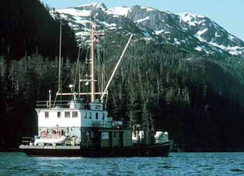
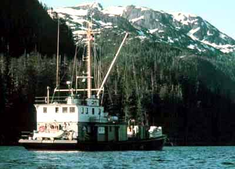

# AutoLevels Effect

AutoLevels automatically adjusts brightness and contrast to produce a balanced image with a good range of color intensities. In doing so it performs a function very much like the Levels effect, automatically deriving settings based on the image provided.

## Settings

| Name | Default | Description | 
| --- | --- | --- |
| Clip | 0.5 % | The percentage of extreme color values to ignore. This applies to the top and the bottom extremes. | 

## Workings

Well defined images span an entire range of color intensities. However it is common to find images that do not. If a photo has been overexposed it will be too bright - there will be few colors at the low ends of intensity and many at the high end. Similarly if a photograph has been underexposed it will be very dark - all the colors will be at the low end of the range and virtually none at the high end.

The AutoLevels effect detects and fixes this kind of imbalance. It scans through the levels of intensity within the image and chooses a level that should be regarded as black (low intensity) and another that should be regarded as white (high intensity). It then stretches the levels in the image so that all the intensities present lie between the black and the white points. This results in an image with a good span of color intensities.

To mitigate the effect of outliers - small numbers of pixels at extreme values of intensity - a clipping percentage is used. By default the value is 0.5% which means that the bottom and top 0.5% of pixels will be ignored when determining the black and white points.

## Example

The following example images show the effect of AutoLevels at different clipping levels.

[C#]

```csharp
void function() {
  using (Doc doc = new Doc()) {
    AddImagePage(doc, img1); // original image
    doc.Rendering.Save("EffectAutoLevels5.jpg");
    using (ImageLayer layer = AddImagePage(doc, img1)) {
      using (EffectOperation effect = new EffectOperation("Auto Levels")) {
        effect.Parameters["Clip"].Value = 0.5;
        effect.Apply(layer.PixMap);
      }
    }
    doc.Rendering.Save("EffectAutoLevels50.jpg");
    using (ImageLayer layer = AddImagePage(doc, img1)) {
      using (EffectOperation effect = new EffectOperation("Auto Levels")) {
        effect.Parameters["Clip"].Value = 5.0;
        effect.Apply(layer.PixMap);
      }
    }
    doc.Rendering.Save("EffectAutoLevels.jpg");
  }
}
```

<span class=language>[Visual Basic]</span>
```vbnet
Sub ...
  Using doc As New Doc()
    AddImagePage(doc, img1)
    ' original image
    doc.Rendering.Save("EffectAutoLevels5.jpg")
    Using layer As ImageLayer = AddImagePage(doc, img1)
      Using effect As New EffectOperation("Auto Levels")
        effect.Parameters("Clip").Value = 0.5
        effect.Apply(layer.PixMap)
      End Using
    End Using
    doc.Rendering.Save("EffectAutoLevels50.jpg")
    Using layer As ImageLayer = AddImagePage(doc, img1)
      Using effect As New EffectOperation("Auto Levels")
        effect.Parameters("Clip").Value = 5.0
        effect.Apply(layer.PixMap)
      End Using
    End Using
    doc.Rendering.Save("EffectAutoLevels.jpg")
  End Using
End Sub
```


                  Original Image before AutoLevels
                  After AutoLevels Clip 0.5%
                  After AutoLevels Clip 5.0%